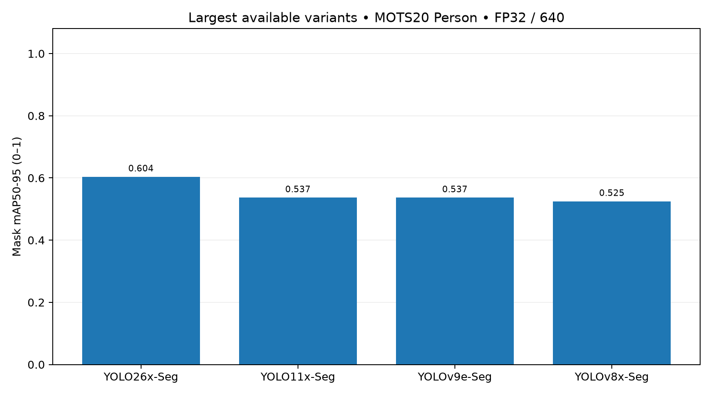
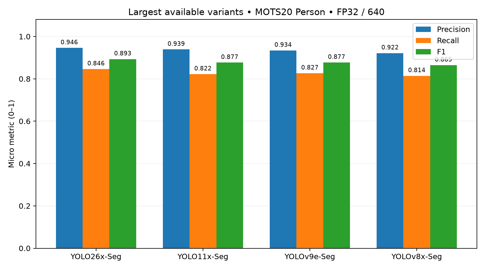
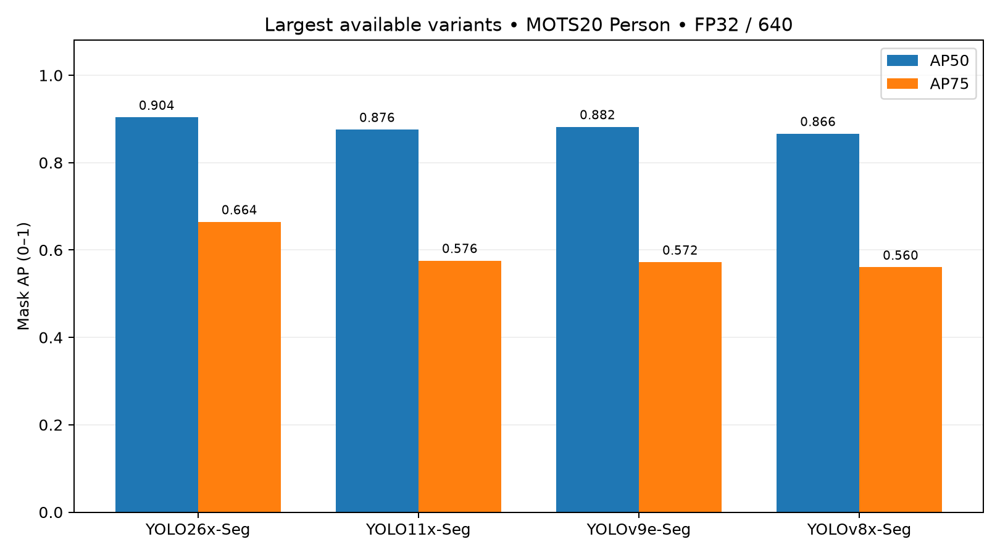
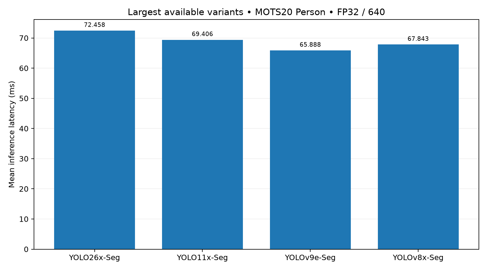
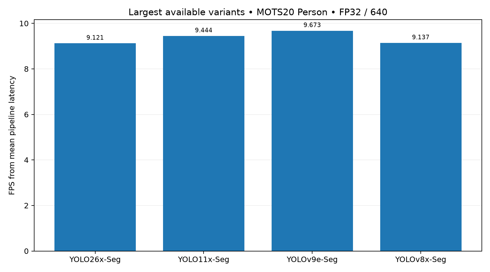
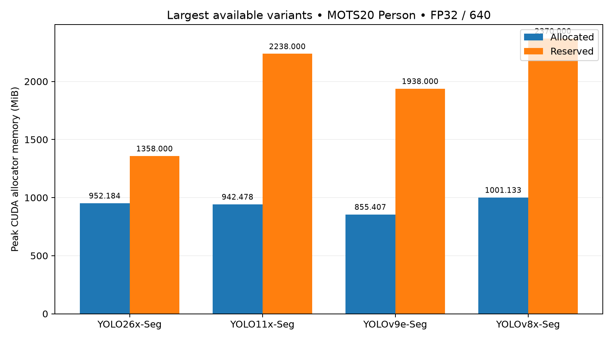
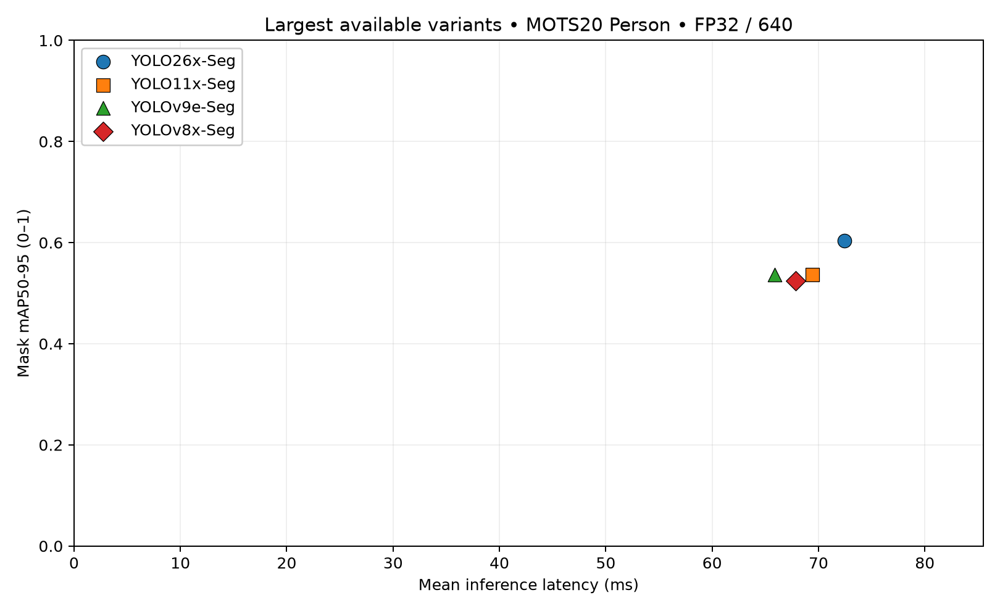

# YOLO Instance Segmentation Benchmark — อธิบายผลแบบเข้าใจง่าย

- เปรียบเทียบ **YOLO26x-Seg, YOLO11x-Seg, YOLOv9e-Seg และ YOLOv8x-Seg** รุ่น segmentation ใหญ่ที่สุดที่เลือกจากแต่ละตระกูล
- ใช้ **MOTS20 train ครบ 2,862 ภาพ และ 26,894 Person GT instances** ซึ่งนับคนแยกตามภาพ ไม่ใช่จำนวนคนไม่ซ้ำทั้งวิดีโอ
- ใช้ pretrained checkpoints โดย **ไม่ฝึกใหม่และไม่ fine-tune** เพื่อดูการนำโมเดลสำเร็จรูปมาใช้กับข้อมูลชุดนี้
- ทุกโมเดลใช้ภาพและเกณฑ์เดียวกัน: Tesla T4, FP32, batch 1, input 640×640 และ NMS-based prediction
- **YOLO26x-Seg ได้ Mask mAP50-95 สูงสุด 0.603730** และ Recall สูงสุด 0.846285
- **YOLOv9e-Seg เร็วสุดและใช้ peak allocated VRAM ต่ำสุด**: inference 65.888 ms, pipeline 103.376 ms, 855.407 MiB
- YOLO11x กับ YOLOv9e มี mAP แทบเสมอกัน; ผลนี้ช่วยเลือกตัวแทนไปทดลองต่อ แต่ **ยังไม่ยืนยันความทนทานใน CCTV จริงทุกสภาพ**

เอกสารนี้ = **คำอธิบายและการตีความแบบอ่านง่าย** · [REPORT.md](REPORT.md) = ผลทางเทคนิคฉบับเต็ม · [EXPERIMENT_PROTOCOL.md](EXPERIMENT_PROTOCOL.md) = วิธีทดลองที่กำหนดไว้

อ้างอิง run `benchmark-20260929T0520Z` สถานะ **PASS WITH WARNINGS** ตัวเลขด้านล่างมาจาก artifacts เดิมและปัดเศษเพื่ออ่านง่าย; การเขียนเอกสารนี้ไม่ได้รันโมเดลหรือคำนวณ metric ใหม่

## 1. งานนี้กำลังทดสอบอะไร?

**Person instance segmentation** คือการหาพิกเซลที่เป็นคนและแยก mask ของแต่ละคนออกจากกัน ไม่ใช่เพียงวาดกรอบ และไม่ใช่การติดตามว่าคนเดิมย้ายไปไหนในวิดีโอ

| โมเดล | Checkpoint ที่ใช้ |
|---|---|
| YOLO26x-Seg | `yolo26x-seg.pt` |
| YOLO11x-Seg | `yolo11x-seg.pt` |
| YOLOv9e-Seg | `yolov9e-seg.pt` |
| YOLOv8x-Seg | `yolov8x-seg.pt` |

YOLOv9 ใช้ **e** เพราะเป็น segmentation variant ใหญ่ที่สุดใน official Ultralytics family ที่ใช้ในงานนี้ และไม่มี x segmentation checkpoint ใน family นี้ ดังนั้นคำอธิบายที่ถูกคือ **largest available segmentation variants** ไม่ใช่ parameter-matched models; ตัวอักษร x/e ไม่ได้แปลว่าความจุเท่ากัน

**Pretrained** หมายถึงโมเดลมีน้ำหนักที่ผ่านการฝึกมาแล้ว เรานำมาทำนาย MOTS20 train ทั้ง 4 sequences โดยไม่ปรับน้ำหนัก แม้ชื่อชุดข้อมูลจะเป็น “train” งานนี้ก็ไม่ได้ใช้ภาพเหล่านี้ฝึกโมเดล

```text
ภาพ → YOLO → Person masks → เทียบ Ground Truth → คำนวณ metrics
```

เหตุผลที่ให้ทุกโมเดลรับภาพและเงื่อนไขเดียวกัน คือช่วยลดข้อได้เปรียบจากการเลือกภาพง่ายกว่า ใช้ความละเอียดต่างกัน หรือปรับ threshold ให้เฉพาะโมเดล แต่ยังแยกผลของ architecture ออกจากความจุและวิธี pretraining ไม่ได้

## 2. ทำไมต้องใช้ Ground Truth?

**Ground Truth (GT)** คือคำตอบอ้างอิงที่ annotation ระบุว่าคนอยู่ตรงไหนและมี mask อย่างไร หากดูแต่ภาพที่โมเดลทำนาย เราอาจเห็น mask สวยแต่ไม่รู้ว่าพลาดคนไปกี่คน

ตัวอย่างสมมติเพื่ออธิบาย ไม่ใช่ผลที่วัดจากภาพใดใน benchmark: จริงมีคน **10 คน** โมเดลจับคู่ได้ถูก **8 คน**, หาเกิน **1 อัน**, พลาด **2 คน**

| คำ | ความหมาย | ตัวอย่าง |
|---|---|---:|
| TP — True Positive | prediction จับคู่กับคนจริงผ่านเกณฑ์ | 8 |
| FP — False Positive | prediction ที่ไม่ผ่านการจับคู่ และไม่ถูกยกเว้นโดย ignore policy | 1 |
| FN — False Negative | คนจริงที่ไม่มี prediction จับคู่ผ่านเกณฑ์ | 2 |

ในงานนี้การนับ TP ต้องให้ mask IoU ≥0.50 และจับคู่แบบหนึ่งต่อหนึ่งด้วย ไม่ใช่แค่กรอบอยู่ใกล้คน; mask ที่คลาดเคลื่อนมากจึงอาจทำให้มีทั้ง FP และ FN

## 3. Metric แต่ละตัวคืออะไร?

คะแนนคุณภาพในตารางใช้สเกล **0–1** เช่น Recall 0.846285 เท่ากับประมาณ 84.63% ส่วน AP เป็นคะแนนสรุป ไม่ใช่เปอร์เซ็นต์คนที่หาเจอโดยตรง

| Metric | วัดอะไร | ค่ายิ่ง...ยิ่งดี | อ่านง่าย ๆ ว่า | ข้อควรระวัง |
|---|---|---|---|---|
| TP | จำนวนจับคู่ถูก | สูง เมื่อ GT/เงื่อนไขเท่ากัน | หาเจอถูกกี่ครั้ง | เทียบจำนวนดิบข้ามชุดข้อมูลต่างขนาดไม่ได้ |
| FP | จำนวน prediction ที่ผิด | ต่ำ | หาเกินหรือจับคู่ไม่ผ่านกี่อัน | prediction ใน ignore region มีเกณฑ์ยกเว้น |
| FN | จำนวนคนจริงที่พลาด | ต่ำ | พลาดกี่ครั้ง | รวมกรณีมี prediction แต่ mask ไม่ผ่านเกณฑ์ |
| Precision | TP / (TP+FP) | สูง | ที่บอกว่าเจอ เชื่อถือได้แค่ไหน | สูงได้แม้พลาดคนมาก |
| Recall | TP / (TP+FN) | สูง | คนจริงถูกหาเจอครบแค่ไหน | ต้องอ่านคู่กับ FP |
| F1-score | สมดุล Precision กับ Recall | สูง | เจอถูกและเจอครบไปพร้อมกันแค่ไหน | ไม่ได้วัดรายละเอียดขอบ mask โดยตรง |
| Mask IoU | พื้นที่ mask ทับกัน / พื้นที่รวม | สูง | mask สองอันทับกันดีแค่ไหน | ที่รายงานเป็นค่าเฉลี่ย **TP-only** |
| Dice | คะแนนความทับซ้อนอีกแบบ | สูง | mask สอดคล้องกันแค่ไหน | TP-only และสเกลไม่เท่ากับ IoU |
| AP50 | AP ที่ mask IoU ≥0.50 | สูง | คุณภาพเมื่อเกณฑ์จับคู่ค่อนข้างผ่อนปรน | ไม่ใช่ Recall ที่ confidence เดียว |
| AP75 | AP ที่ mask IoU ≥0.75 | สูง | คุณภาพเมื่อ mask ต้องตรงมากขึ้น | เข้มกว่า AP50 |
| Mask mAP50-95 | เฉลี่ย AP หลายเกณฑ์ IoU | สูง | คุณภาพตั้งแต่เกณฑ์ผ่อนปรนถึงเข้มมาก | metric หลักของงานนี้ ไม่ใช่ tracking score |
| Inference Latency | เวลาคำนวณ forward ของ network | ต่ำ | ตัว neural network ใช้กี่ ms/ภาพ | ไม่รวมกระบวนการทั้งหมด |
| Pipeline Latency | preprocess + inference + postprocess | ต่ำ | ขั้นตอนฝั่งโมเดลรวมใช้กี่ ms/ภาพ | ยังไม่ใช่เวลารวมระบบ CCTV |
| FPS | จำนวนภาพ/วินาทีจาก mean pipeline latency | สูง | throughput ตามวิธีวัดนี้ | ไม่รวม RLE preparation, I/O และ evaluator |
| Peak VRAM | หน่วยความจำ GPU สูงสุดที่วัด | ต่ำ เมื่อคุณภาพเพียงพอ | ต้องใช้ทรัพยากรมากแค่ไหน | แยก allocated กับ reserved; ไม่ใช่ VRAM ทั้ง GPU |
| Parameters | จำนวนค่าน้ำหนักที่เรียนรู้ | ไม่มีทิศทาง “ดี” ตายตัว | โมเดลมีขนาดเชิงน้ำหนักเท่าไร | มากไม่รับประกันแม่นกว่า |
| GFLOPs | ปริมาณคำนวณโดยประมาณ | ต่ำในแง่ต้นทุน เมื่อคุณภาพพอ | งานคำนวณหนักประมาณไหน | ไม่ใช่เวลา runtime ที่วัดจริง |
| Checkpoint size | ขนาดไฟล์น้ำหนักบนดิสก์ | ต่ำในแง่จัดเก็บ | ต้องเก็บ/ส่งไฟล์ใหญ่เท่าไร | ไม่เท่ากับ runtime VRAM |

## 4. อธิบาย Accuracy Metrics แบบเห็นภาพ

**Precision:** “ที่โมเดลบอกว่าเป็นคน มีสัดส่วนกี่อันที่ถูกจริง” จากตัวอย่าง TP=8, FP=1 จะได้ 8/9 ≈ **88.89%**

**Recall:** “คนที่มีจริงทั้งหมด โมเดลหาเจอได้กี่เปอร์เซ็นต์” จาก TP=8, FN=2 จะได้ 8/10 = **80%**

**F1-score:** ให้ความสำคัญกับทั้งความถูกและความครบ ใช้ `2×TP / (2×TP+FP+FN)` ตัวอย่างนี้ได้ 16/19 ≈ **84.21%** การรายงานของจริงรวม TP/FP/FN ทั้ง dataset ก่อนคำนวณ เรียกว่า micro aggregation ไม่ใช่เฉลี่ยเปอร์เซ็นต์รายภาพ

**IoU** ใช้พื้นที่ ไม่ใช่จำนวนคน:

```text
GT mask       ███████
Prediction      ███████
ส่วนทับกัน      █████
พื้นที่รวม    █████████
```

ภาพจำลองหนึ่งมิตินี้มีส่วนทับกัน 5 ส่วน พื้นที่รวม 9 ส่วน จึงได้ IoU = 5/9 ≈ 0.556; สำหรับ mask จริงจะนับพิกเซลในสองมิติ

**Dice** เป็นคะแนน overlap อีกแบบ สำหรับ mask คู่เดียวกัน `Dice = 2×IoU / (1+IoU)` จึงมักมีตัวเลขสูงกว่า IoU ทั้งที่ใช้ mask เดิม ไม่ได้หมายถึงประเมินคนละ prediction

> **ข้อสำคัญที่สุด:** TP-only IoU/Dice ของงานนี้เฉลี่ยเฉพาะคนที่จับคู่สำเร็จ คนที่พลาดไม่อยู่ในค่าเฉลี่ยนี้ เช่น YOLO26x มี TP-only IoU 0.828873 แต่ Recall ยังเป็น 0.846285 ไม่ได้หาเจอทุกคน และไม่ควรนำค่าเฉลี่ย IoU ไปแทนในสูตรเพื่อคาดค่าเฉลี่ย Dice ตรง ๆ เพราะสูตรไม่เป็นเส้นตรง

## 5. AP50, AP75 และ mAP50-95 ต่างกันอย่างไร?

**AP — Average Precision** สรุปความสัมพันธ์ของ Precision และ Recall เมื่อพิจารณา predictions ตามลำดับ confidence จากสูงไปต่ำ จึงรวมเรื่องการจัดอันดับความมั่นใจเข้าด้วย ไม่ใช่คะแนนที่ confidence 0.25 จุดเดียว

- **AP50:** อนุญาตให้จับคู่เมื่อ mask IoU ≥0.50 ถามประมาณว่า “จับคนและ mask ได้พอทับกันไหม?”
- **AP75:** ต้องมี mask IoU ≥0.75 ถามว่า “mask แม่นตำแหน่งและรูปร่างมากขึ้นไหม?”
- **Mask mAP50-95:** เฉลี่ย AP ที่ IoU **0.50, 0.55, 0.60, 0.65, 0.70, 0.75, 0.80, 0.85, 0.90, 0.95** ถามว่า “เมื่อเพิ่มความเข้มงวด โมเดลยังรักษาคุณภาพได้แค่ไหน?”

งานนี้ใช้ **Mask mAP50-95 เป็น metric หลัก** เพราะการได้คะแนนดีที่เกณฑ์เดียวอาจซ่อนความคลาดเคลื่อนของ mask ส่วนการเฉลี่ยหลายเกณฑ์ช่วยตรวจทั้งการหาคนและความแม่นของ mask อย่างเข้มขึ้น งานนี้มีเฉพาะ category Person ไม่ใช่ค่าเฉลี่ยหลายชนิดวัตถุ

## 6. ผลรวม 4 โมเดล

ตัวหนาคือค่าดีที่สุดใน metric คุณภาพ/เวลา/FPS/peak allocated VRAM; Parameters แสดงจำนวนจริงโดยไม่ตีความว่าน้อยหรือมากคือดีกว่า ตารางกว้างสามารถเลื่อนแนวนอนได้

| Model | Mask mAP50-95 | AP50 | AP75 | Precision | Recall | F1 | TP-only IoU | TP-only Dice | Inference ms | Pipeline ms | FPS | Peak VRAM allocated (MiB) | Parameters |
|---|---:|---:|---:|---:|---:|---:|---:|---:|---:|---:|---:|---:|---:|
| YOLO26x-Seg | **0.603730** | **0.903687** | **0.664426** | **0.946008** | **0.846285** | **0.893372** | **0.828873** | **0.902919** | 72.458 | 109.639 | 9.121 | 952.184 | 70,693,800 |
| YOLO11x-Seg | 0.536674 | 0.875806 | 0.575845 | 0.938702 | 0.822228 | 0.876613 | 0.801385 | 0.886046 | 69.406 | 105.885 | 9.444 | 942.478 | 62,142,656 |
| YOLOv9e-Seg | 0.536642 | 0.882037 | 0.572100 | 0.934230 | 0.826578 | 0.877113 | 0.799298 | 0.884605 | **65.888** | **103.376** | **9.673** | **855.407** | 60,512,800 |
| YOLOv8x-Seg | 0.524758 | 0.866402 | 0.560452 | 0.921598 | 0.814271 | 0.864616 | 0.798136 | 0.883841 | 67.843 | 109.441 | 9.137 | 1001.133 | 71,827,888 |



แท่งสูงหมายถึง Mask mAP50-95 ดีกว่า และ YOLO26x มีคะแนนสูงสุดในการทดลองนี้ กราฟปัดเลขจน YOLO11x และ YOLOv9e แสดง 0.537 เหมือนกัน; ตารางเก็บ 6 ตำแหน่งเพื่อไม่ซ่อนว่ามีส่วนต่างเล็กมาก

## 7. อ่านผลแต่ละโมเดลแบบภาษาคน

### YOLO26x-Seg

จุดเด่นไม่ได้มีแค่ AP50 แต่ยังนำ AP75, mAP50-95, Recall และ matched-mask quality พร้อมกัน จึงมีหลักฐานหลายด้านว่าทั้งหาเจอครบกว่าและให้ mask ที่ตรงกว่าในชุดนี้ โดย Recall ประมาณ **84.63%** ยังเหลือคนที่จับคู่ไม่ผ่านหรือพลาดอยู่

สิ่งที่แลกคือ inference **72.458 ms** ซึ่งมากที่สุดในกลุ่ม และ allocated VRAM สูงกว่า YOLOv9e แต่ไม่ได้สูงสุดทั้งกลุ่ม หากยอมเพิ่มเวลาเล็กน้อยเพื่อ mask accuracy ที่ดีขึ้น รุ่นนี้เป็นตัวเลือกนำไปทดลองต่อ

### YOLO11x-Seg

mAP แทบเท่า YOLOv9e แต่ AP75 และ TP-only IoU/Dice สูงกว่าเล็กน้อย ขณะที่ Recall ต่ำกว่าและ latency สูงกว่า จึงไม่ควรเรียกว่า “สมดุลดีที่สุด” โดยอัตโนมัติ

ใช้เป็นตัวแทนเปรียบเทียบที่มีประโยชน์ โดยเฉพาะเมื่อต้องการดูว่าความต่างของความแม่น mask กับการหาเจอครบจะยังอยู่หรือไม่เมื่อเปลี่ยนข้อมูล การตัดสินระหว่างรุ่นนี้กับ YOLOv9e ต้องไม่อาศัย mAP หลักทศนิยมท้าย ๆ อย่างเดียว

### YOLOv9e-Seg

เป็นตัวเลือกเด่นด้านทรัพยากรในเงื่อนไขนี้: inference และ pipeline เร็วสุด พร้อม peak allocated VRAM ต่ำสุด ที่สำคัญคือ mAP แทบเท่า YOLO11x ไม่ได้แลกความเร็วกับการลด mAP ลงมากเมื่อเทียบคู่นี้

อย่างไรก็ตาม mAP และ AP75 ยังต่ำกว่า YOLO26x อย่างเห็นได้ในค่าที่วัด จึงเหมาะกับการพิจารณาเมื่อ latency/VRAM มีน้ำหนักในการตัดสิน มากกว่าจะสรุปว่าเป็นผู้ชนะทุกด้าน

### YOLOv8x-Seg

มี mAP ต่ำสุดและ allocated VRAM สูงสุดในสี่รุ่นนี้ แม้ forward จะเร็วกว่า YOLO11x และ YOLO26x แต่เมื่อรวม postprocessing แล้ว pipeline อยู่ใกล้ YOLO26x และช้ากว่า YOLOv9e

จึงไม่ใช่ตัวเลือกนำจากคู่ accuracy–latency ในผลนี้ แต่ยังมีประโยชน์เป็น baseline ของรุ่นก่อน ผลนี้ไม่พิสูจน์ว่า architecture รุ่นเก่าด้อยกว่าเสมอ เพราะ checkpoint, ความจุและวิธีฝึกเดิมไม่เท่ากัน

## 8. ใครชนะด้านไหน?

| ด้าน | โมเดลเด่น | เหตุผล |
|---|---|---|
| Highest Mask accuracy | YOLO26x-Seg | mAP50-95 = 0.603730 |
| Highest Recall | YOLO26x-Seg | Recall = 0.846285 |
| Highest AP75 | YOLO26x-Seg | AP75 = 0.664426 |
| Best matched-mask quality | YOLO26x-Seg | TP-only IoU/Dice = 0.828873 / 0.902919 |
| Fastest inference | YOLOv9e-Seg | 65.888 ms |
| Fastest pipeline | YOLOv9e-Seg | 103.376 ms |
| Lowest peak allocated VRAM | YOLOv9e-Seg | 855.407 MiB |
| Accuracy–speed trade-off | YOLO26x / YOLO11x / YOLOv9e | อยู่บน measured Pareto frontier; เลือกตามข้อจำกัด ไม่ให้คะแนนรวมถ่วงน้ำหนัก |

## 9. Insight สำคัญจากผลนี้

### A. YOLO26x ได้ accuracy เพิ่มเท่าไร?

คำนวณจากค่าความละเอียดเต็มใน comparison CSV ก่อนปัดเศษ โดยใช้โมเดลที่นำมาเทียบเป็นฐานของ relative improvement

| YOLO26x เทียบกับ | Absolute difference ของ mAP | เมื่อแสดง AP เป็น 0–100 | Relative improvement |
|---|---:|---:|---:|
| YOLO11x | +0.067056 | +6.706 จุดเปอร์เซ็นต์ | +12.495% |
| YOLOv9e | +0.067088 | +6.709 จุดเปอร์เซ็นต์ | +12.501% |
| YOLOv8x | +0.078972 | +7.897 จุดเปอร์เซ็นต์ | +15.049% |

ตัวอย่าง YOLO26x เทียบ YOLO11x: `0.6037298757 − 0.5366738467 ≈ 0.067056` ส่วน relative improvement คือ `0.067056 / 0.5366738467 × 100 ≈ 12.495%`

> **+6.706 จุดเปอร์เซ็นต์ กับ +12.495% เป็นส่วนต่างเดียวกันที่ใช้ฐานคนละแบบ** ไม่ได้แปลว่าหาเจอเพิ่ม 12.495% ของคนจริงทั้งหมด เพราะ AP ไม่ใช่ Recall

### B. YOLO11x กับ YOLOv9e แทบเสมอกัน

ส่วนต่าง mAP เพียงประมาณ **0.00003190** หรือ **0.003190 จุดเปอร์เซ็นต์** แม้ YOLO11x จะมากกว่าในตัวเลข แต่ไม่มี confidence interval หรือการทดสอบนัยสำคัญที่รองรับว่าความต่างนี้สำคัญจริง ภาพวิดีโอต่อเนื่องก็สัมพันธ์กัน จึงไม่ควรถือว่าภาพทุกใบเป็นตัวอย่างอิสระ

### C. เพิ่ม accuracy แลกกับเวลากี่ ms?

เทียบกับ YOLOv9e, YOLO26x ใช้ inference เพิ่ม **6.570 ms** และ pipeline เพิ่ม **6.263 ms** ต่อภาพ เพื่อแลกกับ mAP เพิ่มประมาณ **6.709 จุดเปอร์เซ็นต์** เป็นส่วนต่างระดับไม่กี่ ms ไม่ใช่หลายเท่า แต่จะเล็กหรือใหญ่ในเชิงใช้งานขึ้นกับงบ latency และจำนวน stream

ไม่สามารถแปลง “AP เพิ่ม” เป็นความคุ้มค่าทางธุรกิจโดยตรง และยังไม่ได้วัดระบบหลายกล้องพร้อมกัน จึงควรใช้เป็นข้อมูลตัดสินใจเบื้องต้น

### D. YOLOv9e ประหยัดตรงไหน?

เมื่อใช้ YOLO26x เป็นฐาน YOLOv9e มี inference latency ต่ำกว่าประมาณ **9.07%**, pipeline latency ต่ำกว่า **5.71%** และ peak allocated VRAM ต่ำกว่า **96.777 MiB หรือ 10.16%** นี่คือการลดเวลา/หน่วยความจำ ไม่ใช่เปอร์เซ็นต์ FPS ที่เพิ่มขึ้น ซึ่งเป็นคนละสูตร

### E. YOLOv8x อยู่ตรงไหน?

YOLOv9e มีทั้ง mAP สูงกว่าและ inference เร็วกว่า YOLOv8x ในค่าที่วัด จึงเป็นตัวเลือกที่ได้เปรียบสำหรับสองเป้าหมายนี้ ส่วนการที่ YOLOv8x มี Parameters มากที่สุดแต่ไม่ได้แม่นที่สุด แสดงว่าไม่ควรใช้จำนวน Parameters แทนผลทดสอบจริง

## 10. Precision สูงแต่ Recall ต่ำ หมายถึงอะไร?

หมายถึง “โมเดลค่อนข้างระวัง เมื่อบอกว่ามีคนมักถูก แต่ยังมีคนจริงบางส่วนที่หาไม่เจอ” ในที่นี้คือคำอธิบายผล ณ confidence ≥0.25 ไม่ใช่หลักฐานว่าโมเดลถูกออกแบบให้ระวังเป็นพิเศษ

YOLO26x มี **TP=22,760, FP=1,299, FN=4,134** จึงได้ Precision ประมาณ **94.60%** แต่ Recall ประมาณ **84.63%** จาก GT 26,894 instances แม้ prediction ที่นำมานับจะค่อนข้างถูก แต่ยังมี GT ที่พลาดหลายพันครั้งตามเฟรม

prediction ที่ถูก ignore ไม่ใช่ FP ปกติ; YOLO26x มี ignored predictions ที่ fixed threshold **5,131** ครั้ง ตัวหารของ Precision จึงเป็น TP+FP ไม่ใช่ predictions ทั้งหมดก่อนจัดการ ignore regions



แท่งสูงยิ่งดีสำหรับทั้งสาม metric ทุกโมเดลมี Precision สูงกว่า Recall และ YOLO26x สูงสุดทั้งสามค่าในชุดนี้ จึงควรอ่านทั้ง “หาแล้วถูก” และ “หาได้ครบ” ไม่ดู Precision ค่าเดียว

## 11. AP50 สูง แต่ mAP50-95 ต่ำกว่ามาก หมายถึงอะไร?

YOLO26x มี AP50 **0.903687**, AP75 **0.664426**, แต่ mAP50-95 **0.603730** สอดคล้องกับภาพว่าจับคนและ mask ให้ทับกันผ่านเกณฑ์ผ่อนปรนได้ดีกว่าการทำให้ mask ตรงมาก ๆ

เมื่อเพิ่มเกณฑ์ IoU ความคลาดเคลื่อนของขอบ รูปร่าง และตำแหน่ง mask มีผลมากขึ้น อย่างไรก็ตามส่วนต่าง AP ไม่ได้วัด “ความผิดของขอบ” เพียงอย่างเดียว ยังเกี่ยวกับ confidence ranking, FP และ FN ด้วย จึงไม่ควรแปลงส่วนต่างนี้เป็นเปอร์เซ็นต์คนที่ขอบ mask ผิด



แท่งสูงหมายถึง AP ดีกว่า และแท่ง AP75 ต่ำกว่า AP50 ทุกโมเดล เพราะเกณฑ์จับคู่เข้มกว่า YOLO26x ยังนำที่ AP75 จึงมีหลักฐานด้าน mask alignment เพิ่มเติมจากการดู AP50 อย่างเดียว

## 12. Speed Metrics ต้องอ่านอย่างไร?

| ขั้นตอน | ทำอะไร | รวมใน pipeline latency? |
|---|---|---|
| Preprocessing | resize/letterbox, แปลงข้อมูลและส่งเข้า GPU | รวม |
| Inference | neural network forward เพื่อสร้างผลดิบ | รวม |
| Postprocessing | NMS, สร้าง native masks, ตรวจ binary mask, bit-pack และส่งข้อมูล compact กลับ CPU | รวม |
| RLE/evaluator preparation | แปลง mask เป็น Run-Length Encoding ซึ่งเก็บ mask แบบบีบอัดโดยไม่เสียข้อมูล | ไม่รวม; วัดแยก |
| Metric computation / I/O | เทียบ GT, คำนวณคะแนน, อ่านเขียนไฟล์/ภาพ | ไม่รวม |

ตัวอย่าง YOLO26x: preprocess **1.717 ms** + inference **72.458 ms** + postprocess **35.464 ms** ≈ pipeline **109.639 ms** ขณะที่ RLE preparation เฉลี่ย **205.007 ms** แยกต่างหาก จึงห้ามเรียกเวลาหลังนี้ว่า network inference latency

วิธีคำนวณคือ **FPS = 1000 / mean pipeline_ms** เช่น YOLOv9e ได้ `1000 / 103.375589 ≈ 9.673 FPS` ไม่ใช่การเฉลี่ย FPS ของแต่ละภาพ และไม่ใช่ FPS ของระบบ CCTV ทั้งระบบที่มี decode, network, tracking หรือการบันทึกข้อมูล



กราฟนี้วัดเฉพาะ forward ของ network แท่งต่ำยิ่งเร็ว YOLOv9e ต่ำสุดที่ 65.888 ms ส่วน YOLO26x สูงสุดที่ 72.458 ms; ส่วนต่างนี้ยังไม่ใช่ส่วนต่างของกระบวนการทั้งหมด



กราฟ FPS กลับทิศการอ่านเป็นแท่งสูงยิ่งเร็ว เพราะเป็นส่วนกลับของ pipeline latency YOLOv9e สูงสุดที่ 9.673 FPS แต่ตัวเลขนี้ยังไม่รวม RLE preparation และงาน evaluator

## 13. VRAM / Params / GFLOPs บอกอะไร?

**Parameters** คือจำนวนค่าน้ำหนักที่เรียนรู้ เป็นตัวบอกขนาดโมเดลด้านหนึ่ง แต่ไม่ครอบคลุมความสามารถทั้งหมด **GFLOPs** คือปริมาณ floating-point operations ระดับพันล้านโดยประมาณจากเครื่องมือ local ที่ input 640 ไม่ใช่เวลาจริงที่ GPU ใช้

**VRAM** คือหน่วยความจำ GPU ที่สังเกตจาก PyTorch allocator ในการทดลอง ส่วน **Checkpoint MB** คือขนาดไฟล์บนดิสก์ ซึ่งเก็บรูปแบบข้อมูลต่างจากตอนรันและไม่รวม tensors ระหว่างประมวลผล

| Model | Loaded Parameters | GFLOPs โดยประมาณ | Checkpoint MB (ฐานสิบ) | Peak allocated MiB | Peak reserved MiB |
|---|---:|---:|---:|---:|---:|
| YOLO26x-Seg | 70,693,800 | 338.203 | 142.130 | 952.184 | **1,358** |
| YOLO11x-Seg | 62,142,656 | 297.892 | 125.091 | 942.478 | 2,238 |
| YOLOv9e-Seg | 60,512,800 | 238.333 | 122.212 | **855.407** | 1,938 |
| YOLOv8x-Seg | 71,827,888 | 329.189 | 144.102 | 1001.133 | 2,370 |

**Allocated** คือพื้นที่ที่ tensors ใช้อยู่ ส่วน **reserved** คือพื้นที่ที่ allocator จองไว้ รวมส่วน cache ที่ยังไม่ได้ใช้ ตัวเลขนี้รวม resident model และเป็นค่าสูงสุดใน clean timing rounds หลัง reset peak statistics ไม่ใช่หน่วยความจำทั้งการ์ดหรือข้อรับรองว่า GPU ขนาดเท่าค่านี้จะรันได้แน่นอน

> YOLOv9e ต่ำสุดด้าน **allocated** แต่ YOLO26x ต่ำสุดด้าน **reserved** จึงต้องระบุชนิดให้ครบเมื่อพูดว่า “ใช้ VRAM ต่ำสุด”

Parameters ในตารางเป็น loaded checkpoint counts ไม่ใช่จำนวนหลัง fusion ซึ่งรวมชั้นคำนวณเข้าด้วยกันและอาจตัด head ที่ไม่ใช้ เช่น YOLO26x มี fused runtime parameters **62,819,132** ต่างจาก loaded **70,693,800** งานนี้คงค่าที่วัด local ไม่แทนด้วยตัวเลขเว็บไซต์

จำนวน Parameters/GFLOPs มากขึ้นไม่ได้ทำให้ช้าขึ้นเป็นสัดส่วนตรงเสมอ เพราะชนิด operation, รูปแบบการเข้าถึง memory และการทำงานของ GPU ต่างกัน ตัวอย่างในชุดนี้ YOLOv8x มี GFLOPs มากกว่า YOLO11x แต่ forward เร็วกว่า ขณะที่ pipeline กลับช้ากว่า



แท่งต่ำหมายถึงใช้หรือจอง memory น้อยกว่าภายใต้วิธีวัดนี้ โดยสีน้ำเงินเป็น allocated และสีส้มเป็น reserved กราฟจึงมีผู้ที่ต่ำสุดคนละโมเดลตามชนิด memory และไม่ควรรวมสองค่าเป็นค่าเดียว

## 14. MOTS20 มีความยากตรงไหน?

ข้อมูลมีคนเดินหลายคนในภาพ ฉากที่มีคนหนาแน่น ขนาดคนต่างกัน และพื้นที่ annotation ที่กำหนดให้ ignore จึงเป็นแบบทดสอบ Person segmentation ที่มีรายละเอียดมากกว่าภาพคนเดี่ยว

| Sequence | จำนวนภาพ | ความละเอียดต้นฉบับ | GT Person instances |
|---|---:|---|---:|
| MOTS20-02 | 600 | 1920×1080 | 7,039 |
| MOTS20-05 | 837 | 640×480 | 6,570 |
| MOTS20-09 | 525 | 1920×1080 | 4,774 |
| MOTS20-11 | 900 | 1920×1080 | 8,511 |

ทุกภาพถูก letterbox เข้า input 640×640 แบบรักษาอัตราส่วน ส่วน mask ถูกสร้างกลับที่ขนาดภาพต้นฉบับ **Ignore region** ไม่ได้ถูกนับเป็น Person GT ปกติ: จับคู่คนจริงก่อน แล้ว prediction ที่เหลือจะถูกยกเว้นหากทับ union ของ ignore masks อย่างน้อย 50% ของพื้นที่ prediction เอง

ผลจึงอธิบายความสามารถบน MOTS20 Person ตาม policy นี้ ไม่ใช่การทดลองที่ควบคุม CCTV blur/แสง/มุมกล้องแยกกัน และไม่ใช่ official MOTS tracking evaluation

## 15. ผลแยกตาม Sequence บอกอะไร?

ดูเฉพาะ mAP50-95 เพื่อให้เห็นรูปแบบ โดยไม่วางตารางรายละเอียดทั้งหมดซ้ำ:

| Model | MOTS20-02 | MOTS20-05 | MOTS20-09 | MOTS20-11 |
|---|---:|---:|---:|---:|
| YOLO26x-Seg | 0.486317 | 0.649732 | 0.610113 | 0.656433 |
| YOLO11x-Seg | 0.416815 | 0.604070 | 0.533139 | 0.582363 |
| YOLOv9e-Seg | 0.422845 | 0.602120 | 0.527402 | 0.581863 |
| YOLOv8x-Seg | 0.410787 | 0.586309 | 0.521832 | 0.568994 |

**MOTS20-02 ดูยากที่สุดจากค่าที่วัด:** ทุกโมเดลได้ mAP และ Recall ต่ำสุดของตนที่ sequence นี้ เช่น YOLO26x มี Recall **79.66%** เทียบกับ **88.67%** บน MOTS20-09

**Sequence ที่ดูง่ายกว่าไม่ได้เหมือนกันทุกโมเดล:** อีกสามรุ่นได้ mAP สูงสุดบน MOTS20-05 แต่ YOLO26x สูงสุดบน MOTS20-11 และ Recall ของ YOLO26x สูงสุดกลับอยู่บน MOTS20-09 แสดงว่า “ง่าย” ขึ้นกับ metric ด้วย

YOLO26x นำ mAP ทุก sequence และ YOLOv8x ต่ำสุดทุก sequence; คู่ YOLO11x/YOLOv9e สลับลำดับกัน โดย YOLOv9e นำบน MOTS20-02 ส่วน YOLO11x นำอีกสาม sequence ทั้งหมดเป็น **ข้อสังเกตเชิงพรรณนา ไม่ใช่หลักฐานว่าความละเอียดหรือสภาพฉากใดเป็นสาเหตุโดยตรง**

## 16. เรื่องคนตัวเล็ก

**Relative mask area = จำนวนพิกเซลใน GT person mask / จำนวนพิกเซลทั้งภาพ** ช่วยบอกว่าคนกินพื้นที่ภาพมากน้อยเพียงใดโดยปรับตามขนาดภาพแล้ว ตารางนี้แสดงเป็นเปอร์เซ็นต์ของภาพ:

| ตำแหน่งใน distribution | Relative mask area (% ของภาพ) |
|---|---:|
| ต่ำสุด | 0.000145% |
| P10 | 0.081067% |
| P25 | 0.168267% |
| Median / P50 | 0.626784% |
| P75 | 2.134850% |
| P90 | 5.874556% |
| สูงสุด | 33.009766% |

**Percentile** เช่น P10 หมายถึงประมาณ 10% ของ instances มีพื้นที่ไม่เกินค่านี้ ส่วน median แบ่งข้อมูลออกครึ่งหนึ่ง จึงเห็นว่าคนจำนวนมากกินพื้นที่ภาพค่อนข้างน้อย แม้จะยังไม่กำหนดว่าขนาดเท่าใดเรียกว่า “เล็ก”

งานถัดไปสามารถใช้ distribution นี้ร่วมกับ mask/bbox area ที่บันทึกไว้เพื่อกำหนดเกณฑ์ small-person อย่างมีเหตุผล หรือใช้ convention ที่ยอมรับกันแล้ว ต้องระบุเกณฑ์ก่อนเปรียบเทียบผล และ **ยังสรุปไม่ได้ว่ารุ่นใดดีที่สุดสำหรับคนตัวเล็กจากคะแนนรวมเพียงอย่างเดียว**

## 17. Crowd Analysis

งานเดิมจัดกลุ่มตาม **จำนวน valid GT persons ต่อภาพ** ตัวอย่าง Recall จากกลุ่มที่มีจำนวนคนต่างกัน:

| GT persons/frame | จำนวนภาพ | YOLO26x Recall | YOLO11x Recall | YOLOv9e Recall | YOLOv8x Recall |
|---|---:|---:|---:|---:|---:|
| 3 | 14 | 100.00% | 100.00% | 100.00% | 100.00% |
| 10 | 539 | 86.40% | 84.32% | 84.53% | 83.27% |
| 16 | 6 | 73.96% | 66.67% | 76.04% | 73.96% |

กลุ่มที่มีคนมากในตัวอย่างนี้มี Recall ต่ำกว่า คนหลายคนอาจทำให้การแยก mask ยากขึ้นจากการอยู่ใกล้กัน การซ้อนกัน หรือคนที่มีขนาดเล็ก แต่ข้อมูลนี้ไม่แยกสาเหตุเหล่านั้น และแนวโน้มในทุกกลุ่มไม่ได้ลดลงเรียบ ๆ ตามจำนวนคน

> **GT persons/frame ไม่ใช่ occlusion severity** หรือระดับการถูกบัง คนมากอาจไม่บังกันก็ได้ และกลุ่ม 16 คนมีเพียง 6 ภาพ จึงไม่ควรสรุปว่าลำดับโมเดลในกลุ่มเล็กนี้ใช้แทนฉากคนหนาแน่นทั้งหมด

## 18. maxDet คืออะไร และทำไม benchmark ใช้ 200?

**maxDet** คือเพดานจำนวน predictions ต่อภาพที่ evaluator พิจารณา หลังเรียงตาม confidence การตั้งเพดานต่ำเกินไปอาจตัด prediction ที่คะแนนต่ำแต่ยังจับคู่คนจริงได้ จึงกระทบ AP

งานนี้แยกเพดานสองชั้น: model-level `max_det=1000` เพื่อเก็บ candidate tail ก่อนประเมิน และ **AP evaluator maxDet=200**; ค่า 200 ไม่ได้หมายความว่าในภาพมีคนจริง 200 คน ส่วน fixed-threshold metrics ใช้ saved predictions ที่ confidence ≥0.25 ไม่รัน inference ซ้ำ

Preflight ใช้ภาพที่กำหนดก่อนดูผล 100 ภาพ กระจาย 25 ภาพต่อ sequence แล้วประเมิน saved predictions เดิมที่ maxDet **100, 200, 300, 1000** ต้องให้ความต่างสัมบูรณ์จาก 1000 ต่ำกว่า **0.0001** ทั้ง AP50, AP75 และ mAP50-95 สำหรับทุกโมเดล

| Model | ความต่างมากสุดในสาม AP ที่ maxDet=100 | ผลที่ 100 | ที่ 200 / 300 เทียบ 1000 |
|---|---:|---|---|
| YOLO26x-Seg | 0.00002747 | ผ่าน | ทุกค่าตรงกัน |
| YOLO11x-Seg | 0.00004331 | ผ่าน | ทุกค่าตรงกัน |
| YOLOv9e-Seg | 0.00016448 | ไม่ผ่าน — mAP50-95 | ทุกค่าตรงกัน |
| YOLOv8x-Seg | 0.00016711 | ไม่ผ่าน — AP50 | ทุกค่าตรงกัน |

จึงเลือก **200 เป็นค่าร่วมที่เล็กที่สุดที่ผ่าน** แล้ว freeze ก่อนรันเต็ม ไม่ได้เลือก cap แยกตามโมเดล ผลนี้ยืนยัน convergence บน preflight ไม่ใช่หลักฐานว่า cap sensitivity ถูกตรวจครบทุกภาพของ full dataset

## 19. NMS IoU กับ Evaluation IoU ไม่ใช่อันเดียวกัน

| ค่า | ใช้ที่ไหน | เทียบอะไร | ค่าของงานนี้ |
|---|---|---|---:|
| NMS IoU | postprocessing ของโมเดล | bounding boxes ของ predictions เพื่อกดรายการซ้ำ | 0.70 |
| Evaluation matching IoU | fixed-threshold evaluator | predicted mask กับ GT mask เพื่อตัดสิน TP | 0.50 |
| AP evaluation IoUs | AP evaluator | predicted mask กับ GT mask หลายระดับความเข้มงวด | 0.50–0.95 |

**NMS — Non-Maximum Suppression** ช่วยลดการทำนายวัตถุเดียวกันซ้ำ โดยใช้ความมั่นใจและการทับซ้อนของ predictions ส่วน evaluation ต้องอาศัยคำตอบ GT การพูดว่า “NMS=0.70 จึงต้องจับคู่ GT ที่ 0.70” จึงผิดทั้งจุดประสงค์และชนิดพื้นที่ที่เทียบ

YOLO26 ถูกบังคับให้ใช้ NMS-based one-to-many path เหมือนแนวทางของรุ่นอื่น ไม่ได้นำผล NMS-free มาปะปนในตารางนี้

## 20. ทำไมผล Speed ถึงน่าเชื่อถือขึ้น?

- ใช้ Tesla T4 ตัวเดียว, FP32, batch 1, 640×640 และ settings เดียวกัน ไม่มีโมเดลหนึ่งได้ลดความละเอียดเพื่อให้เร็วกว่า
- ใช้ timing subset เดียวกัน 100 ภาพ × 3 รอบต่อโมเดล มี 10 warmup inferences ก่อนแต่ละ run เพื่อให้การเริ่มต้นไม่ปะปนกับค่าที่วัด
- ทำ **CUDA synchronization** คือรอ GPU ทำงานเสร็จที่ขอบเขตแต่ละ stage ไม่จับเพียงเวลาส่งคำสั่งจาก CPU
- โหลดโมเดลทีละตัวและแยก load time ออก พร้อมหมุนลำดับโมเดลด้วย seed 20260929 เพื่อลดความได้เปรียบจากการรันก่อน/หลังเสมอ
- ตรวจ utilization, memory, temperature, power, clocks และ processes ของ GPU; timing pass แรกมี non-idle flags จึง **ตัดทั้ง pass ออกจากผลหลัก** และเก็บหลักฐานไว้
- ชุดใหม่รอ GPU idle แล้วรันซ้ำด้วยวิธีวัดเดิม ครบ **12 clean runs** โดยไม่เปลี่ยนเกณฑ์เพื่อให้รอบที่เคยถูก flag กลายเป็น clean

flags เดิมเกิดจาก utilization ก่อนเริ่มที่ยังไม่ idle แม้ไม่เห็น compute process อื่น ไม่ใช่หลักฐานว่ามีผู้ใช้อื่นรบกวนแน่นอน การควบคุมเหล่านี้ทำให้เปรียบเทียบได้ดีขึ้น แต่ไม่ใช่คำรับรองว่า runtime จะเท่ากันทุกเครื่องหรือทุกระบบจริง

สถานะ PASS WITH WARNINGS ยังรวม CPU NNPACK warning และ pycocotools/NumPy deprecation warning โดย evaluator regression tests ผ่าน 15 ข้อ และ final protocol consistency ผ่าน 36 รายการ ไม่มีการเปลี่ยน packages เพื่อซ่อน warnings

## 21. Pareto Frontier คืออะไร?

คิดง่าย ๆ ว่า ถ้าอีกโมเดล **แม่นกว่าและเร็วกว่า** เราไม่มีเหตุผลจากสองแกนนี้เพียงอย่างเดียวที่จะเลือกตัวที่ด้อยกว่าทั้งคู่ ตัวที่ด้อยกว่านี้เรียกว่า *Pareto-dominated*; โดยทั่วไปอีกตัวอาจเท่ากันหนึ่งด้านและดีกว่าอีกด้านก็ถือว่าครอบได้

เมื่อใช้ **Mask mAP50-95 กับ mean inference latency** ค่า measured frontier ของงานนี้ประกอบด้วย **YOLO26x-Seg, YOLO11x-Seg และ YOLOv9e-Seg** ส่วน YOLOv8x ถูก YOLOv9e ครอบทั้งสองด้าน



แกนตั้งสูงคือแม่นกว่า แกนนอนอยู่ซ้ายคือเร็วกว่า YOLO26x อยู่สูงสุด ขณะที่ YOLOv9e อยู่ซ้ายสุด; จึงมีการแลกระหว่างสองเป้าหมาย ไม่ได้มีจุดเดียวที่ดีที่สุดทุกด้าน

YOLO11x ยังอยู่บน frontier เพราะ mAP มากกว่า YOLOv9e เล็กน้อยตามตัวเลขดิบ แต่ส่วนต่างนั้นแทบเสมอกันและยังไม่มีหลักฐานทางสถิติ frontier นี้จึงเป็นคำอธิบายของค่าที่วัด **ไม่ใช่ใบรับรองว่าทั้งสามมีคุณค่าเชิงใช้งานต่างกันแน่นอน** และไม่ได้รวม VRAM หรือค่าใช้จ่ายเป็นคะแนนรวม

## 22. ถ้าต้องเลือกโมเดลตอนนี้ควรเลือกอะไร?

| เป้าหมาย | ตัวเลือกสำหรับนำไปทดลองต่อ | เหตุผลและสิ่งที่ต้องตรวจเพิ่ม |
|---|---|---|
| Mask accuracy สูงสุดบน benchmark นี้ | YOLO26x-Seg | นำ mAP/AP75/Recall; ตรวจว่ารับ latency และ memory ได้หรือไม่ |
| ลด latency / allocated VRAM | YOLOv9e-Seg | ต่ำสุดทั้งสองด้าน; ตรวจ accuracy บนข้อมูลเป้าหมาย |
| สมดุล accuracy กับ speed | เริ่มเทียบ YOLO26x กับ YOLOv9e ตามงบจริง | ฝั่งหนึ่งได้คุณภาพเพิ่ม อีกฝั่งลดทรัพยากร; ไม่มีน้ำหนักตัดสินสากล |
| สนใจ matched-mask quality ระหว่างรุ่นที่ mAP ใกล้กัน | เก็บ YOLO11x เทียบ YOLOv9e | YOLO11x นำ AP75/TP-only quality เล็กน้อย แต่ช้ากว่า; ต้องยืนยันว่าความต่างมีประโยชน์ |
| ทำวิจัยต่อ | เก็บหลายตัวแทน และ YOLOv8x เป็น baseline หากต้องการ | ช่วยดูว่าลำดับเปลี่ยนหรือไม่เมื่อเปลี่ยนขนาดโมเดล/โดเมน |

คำแนะนำนี้ใช้ผลที่วัดใน MOTS20/T4 เท่านั้น ไม่ใช่การเลือก final CCTV deployment model แล้ว

## 23. สิ่งที่ผลนี้ยังตอบไม่ได้

ยังไม่ได้แยกทดสอบอย่างควบคุมสำหรับ:

- controlled motion blur — ภาพเบลอจากการเคลื่อนไหว
- Gaussian blur — การทำภาพเบลอด้วยตัวกรองที่กำหนดระดับ
- low light และ overexposure — แสงน้อยและภาพสว่างล้น
- CCTV-specific camera angles — หมวดมุมกล้องที่เป็นตัวแทนกล้องวงจรปิดจริง
- explicit occlusion severity — ระดับการถูกบังที่มี label ชัดเจน
- real CCTV domain shift — ความต่างระหว่างข้อมูล benchmark กับสถานที่/กล้องใช้งานจริง

พูดได้ว่า **“YOLO26x มี mask accuracy สูงสุดใน MOTS20 benchmark นี้”** แต่พูดไม่ได้ว่า **“YOLO26x ดีที่สุดสำหรับ CCTV ทุกสภาพอย่างแน่นอน”** และคำว่า “ดีที่สุด” ต้องระบุ metric เพราะด้าน speed/allocated VRAM เป็น YOLOv9e

ข้อจำกัดอื่นคือความจุและ pretraining ของโมเดลต่างกัน ภาพวิดีโอมีความสัมพันธ์กัน และ ignore policy เป็น policy ของ evaluator นี้ ไม่ใช่การประเมิน tracking อย่างเป็นทางการ

## 24. ขั้นต่อไปของงานวิจัย

1. **Largest-model MOTS20 benchmark ✓** — ใช้เป็นผลเปรียบเทียบเบื้องต้นของ pretrained models
2. **Capacity-controlled comparison (ทางเลือก)** — เลือกรุ่นที่ความจุใกล้กัน หากต้องการลดตัวแปรด้านขนาดโมเดล
3. **CCTV-specific robustness benchmark** — กำหนดข้อมูล/GT และเงื่อนไขล่วงหน้า: small person, occlusion, blur, low light/illumination และ camera angle
4. กำหนดเกณฑ์ small person จาก distribution หรือ convention, ใช้ annotation รองรับ occlusion และเปรียบเทียบภาพเดิมข้ามระดับ degradation ที่ควบคุมได้ โดยไม่ใช้จำนวนคนแทนระดับการบัง
5. ประเมิน accuracy และเวลาของระบบเป้าหมายจริง แล้วเลือก final candidate model(s) ตามความผิดพลาดที่ยอมรับได้และงบทรัพยากร; หากต้องการอ้างนัยสำคัญ ให้วางแผนการประเมินความไม่แน่นอนที่เคารพความสัมพันธ์ของเฟรม

ทั้งหมดเป็นข้อเสนอสำหรับงานถัดไป ไม่ใช่การทดลองที่ได้ดำเนินการแล้วในรายงานนี้

### แหล่งตัวเลขและวิธีอ่านไฟล์

ผู้อ่านไม่จำเป็นต้องเปิดไฟล์เหล่านี้เพื่อเข้าใจข้อสรุป แต่ใช้ตรวจสอบย้อนกลับได้:

- [REPORT.md](REPORT.md): ผลเต็มและข้อจำกัด; [EXPERIMENT_PROTOCOL.md](EXPERIMENT_PROTOCOL.md) กับ [benchmark.yaml](configs/benchmark.yaml): วิธีและ settings ที่กำหนดไว้
- [comparison_summary.csv](metrics/comparison_summary.csv), [per_model.csv](metrics/per_model.csv), [per_sequence.csv](metrics/per_sequence.csv): ค่ารวม จำนวนจับคู่ และผลราย sequence
- [clean timing summary](timing/benchmark-20260929T0520Z/clean_repetition/summary.csv): แหล่งความเร็ว/VRAM หลัก ไม่ใช้ summary ของ timing pass แรก
- [person-size distribution](metrics/person_size_distribution.json), [crowd ของ YOLO26x](metrics/benchmark-20260929T0520Z/yolo26x-seg.pt-crowd.csv), [YOLO11x](metrics/benchmark-20260929T0520Z/yolo11x-seg.pt-crowd.csv), [YOLOv9e](metrics/benchmark-20260929T0520Z/yolov9e-seg.pt-crowd.csv), [YOLOv8x](metrics/benchmark-20260929T0520Z/yolov8x-seg.pt-crowd.csv): ข้อมูลขนาดคนและจำนวนคนต่อภาพ
- [preflight maxDet](metrics/preflight_maxdet.csv), [plot values](outputs/plots/benchmark-20260929T0520Z/underlying_values.csv), [protocol consistency](metrics/protocol_consistency.csv): ผลตรวจ cap, ค่าที่ใช้วาดกราฟ และหลักฐานความสอดคล้อง

ค่าหลักใน REPORT, comparison CSV และ clean timing summary สอดคล้องกันในความละเอียดที่รายงาน สำเนา comparison/per-sequence/preflight CSV ระดับ metrics root กับ run directory ตรงกัน ความต่างจาก timing pass แรกเป็นคนละชุดการวัดที่ถูกตัดออก ไม่ได้นำมาปนหรือเลือกเฉพาะค่าที่ดูดีกว่า

## 25. สรุปสุดท้ายแบบจำง่าย

- **เน้น mask accuracy → YOLO26x-Seg** นำทั้ง mAP, AP75 และ Recall ในข้อมูลชุดนี้
- **เน้น speed/allocated VRAM → YOLOv9e-Seg** แต่ lowest reserved VRAM เป็น YOLO26x จึงต้องระบุชนิด memory
- **YOLO11x กับ YOLOv9e แทบเสมอกันด้าน mAP** อย่าใช้ทศนิยมท้าย ๆ ตัดสินความเหนือกว่าเชิงใช้งาน
- **ดู Recall คู่กับ TP-only IoU/Dice และดู pipeline คู่กับ inference** เพื่อไม่ให้คะแนนหรือความเร็วบางส่วนกลบสิ่งที่พลาดไป
- **A: ใช้เป็น preliminary YOLO comparison ได้; B: ยังสรุป final CCTV robustness ไม่ได้** ต้องมีการทดลองเฉพาะโดเมนต่อ
