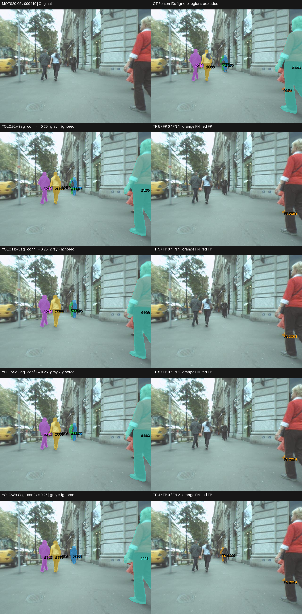
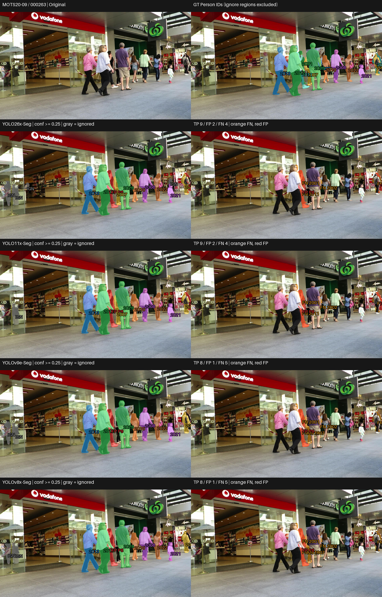
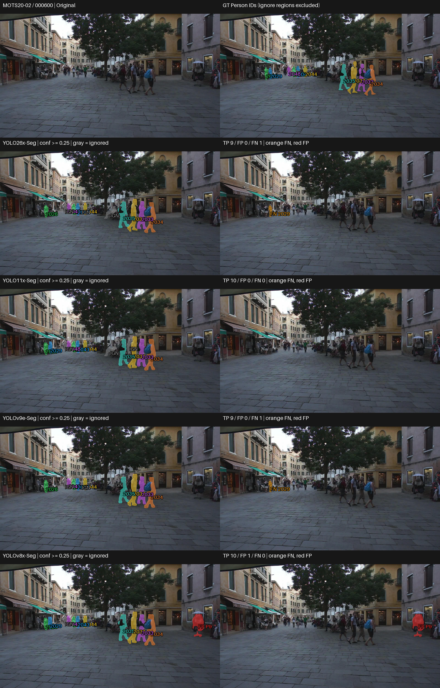
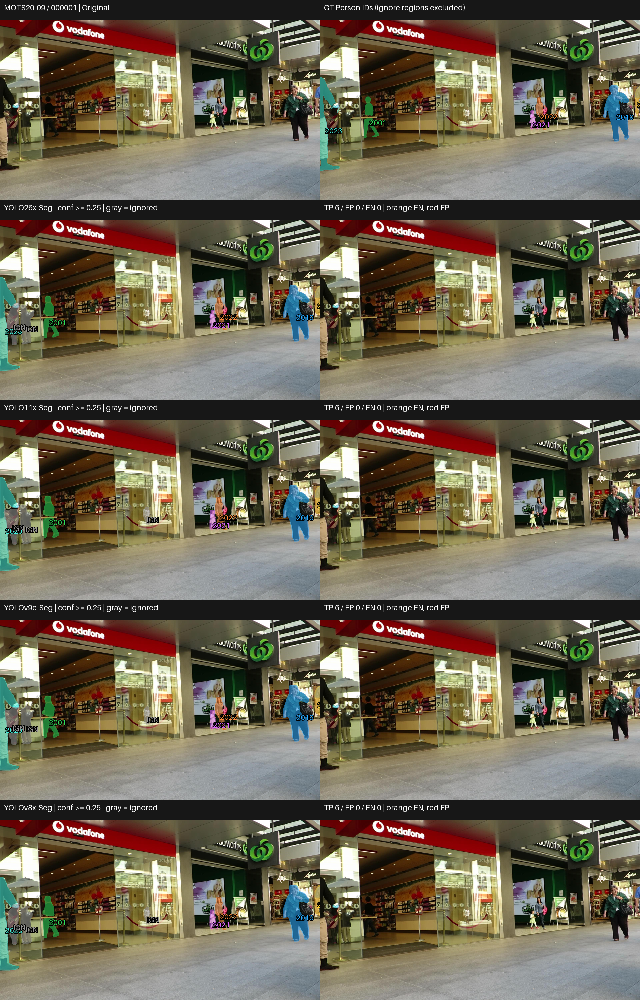

# Largest (X/E) — Visual and Qualitative Analysis

## 1. ภาพรวมผลการทดลอง

Tier นี้เสร็จครบ 4 โมเดลบน MOTS20 ด้วย pretrained / no fine-tuning; คงสถานะ PASS WITH WARNINGS
เอกสารนี้อ่านพฤติกรรมจาก prediction จริง ส่วนผลเชิงตัวเลขและ trade-off เต็มอยู่ที่ [RESULTS_SUMMARY_TH.md](RESULTS_SUMMARY_TH.md)

| Model | Mask mAP50-95 | AP75 | Recall |
|---|---|---|---|
| YOLO26x-Seg | 0.603730 | 0.664426 | 0.846285 |
| YOLO11x-Seg | 0.536674 | 0.575845 | 0.822228 |
| YOLOv9e-Seg | 0.536642 | 0.572100 | 0.826578 |
| YOLOv8x-Seg | 0.524758 | 0.560452 | 0.814271 |

## การเลือกกรณีและการอ่านภาพ

คัด 4 กรณีจาก 12 เฟรมใน frozen visualization manifest โดยอ่าน per-frame TP/FP/FN และตรวจภาพจริง
เลือกทั้งข้อได้เปรียบ ข้อผิดพลาดร่วม กรณีสวนอันดับ และผลคล้ายกัน ไม่ใช่การสุ่มตัวแทน dataset
[CASE_SELECTION.md](outputs/visualizations/qualitative/CASE_SELECTION.md) บันทึกเหตุผลและแหล่งหลักฐาน
ภาพเดิมมี contact sheet แยกโมเดล จึงสร้าง comparison จาก lossless saved RLE และ original/GT โดยไม่ inference
แถวแรกเป็น Original/GT; แถวถัดมาเรียง YOLO26, YOLO11, YOLOv9, YOLOv8;
ซ้ายเป็น prediction ขวาเป็น unmatched overlay ทั้งหมดใช้ภาพเต็มเฟรมเดียวกันและ scale เท่ากัน
สีของ matched mask ผูกกับ GT ID เดียวกัน; สีส้ม FN, สีแดง FP, สีเทา IGN (ignored prediction)
ใช้ confidence ≥0.25, mask matching IoU ≥0.50 และ ignore policy เดิม
FN หมายถึง GT ที่ไม่มีคู่ผ่านเกณฑ์ อาจมาจาก mask ไม่ผ่าน IoU ไม่ใช่ไม่มี detection เสมอ;
FP หมายถึง prediction ที่ไม่ match valid GT และไม่ถูก ignore จึงไม่จำเป็นต้องเป็นคนที่ไม่มีอยู่จริง
GT panel แสดงเฉพาะ Person; IGN ไม่ถูกนับเป็น FP ตัวเลขรายเฟรมตรวจตรงกับ CSV เดิม

## Case 1 — ความต่างที่ Person ขนาดเล็กกลางภาพ

เหตุผลที่เลือก: ตรวจการเก็บ instance เพิ่มของ accuracy leader พร้อมเห็นข้อผิดพลาดที่ยังมีร่วมกัน · MOTS20-05 / 000419

### ภาพเปรียบเทียบ

### สิ่งที่เห็นจากภาพ

- YOLO26x, YOLO11x และ YOLOv9e มี mask ที่ match กับ GT 2002 ซึ่งเป็น Person ขนาดเล็กกลางภาพ; YOLOv8x ไม่มีคู่ที่ผ่าน IoU 0.50 สำหรับคนนี้
- ทั้งสี่โมเดลเก็บ Person คู่กลางภาพและคนใหญ่ริมขวาได้ แต่มี FN 2054 ตรงช่วงขาของคนริมขวาร่วมกัน

### วิเคราะห์

ความต่างอยู่ที่ instance เล็กเพิ่มเติมมากกว่าคนใหญ่ที่ทุกโมเดลเก็บได้; YOLO26 ไม่ได้ได้เปรียบเพียงโมเดลเดียว เพราะ YOLO11x และ YOLOv9e เก็บคนเดียวกันได้ด้วย FN 2054 มีพื้นที่ GT ที่มองเห็นน้อยตรงขาของคนริมขวา ตัวอย่างนี้ชี้ให้ดูบริเวณเฉพาะ instance แทนตัดสินจากคนใหญ่เพียงอย่างเดียว โดยไม่จัดระดับความรุนแรงของ occlusion

### เชื่อมกับผลเชิงตัวเลข

การเก็บ GT 2002 ของ YOLO26x สอดคล้องในทิศทางกับ Recall รวม 0.846285 ที่สูงกว่า YOLOv8x (0.814271) แต่เฟรมเดียวไม่อธิบายช่องว่าง Recall ทั้ง dataset

## Case 2 — พลาดร่วมกันในกลุ่มคนซ้อนกัน

เหตุผลที่เลือก: แสดงข้อจำกัดร่วมและ FP ของทุกโมเดล แทนเลือกแต่ภาพที่ตัวนำได้เปรียบ · MOTS20-09 / 000263

### ภาพเปรียบเทียบ

### สิ่งที่เห็นจากภาพ

- ทุกโมเดลมี FN ของ GT 2001/2002/2011 ในกลุ่มคนกลางภาพ และ 2023 ริมขวา; GT บางส่วนอยู่หลังคนอื่นและมองเห็นเป็นพื้นที่เล็ก
- ทุกโมเดลมี FP แดงบริเวณคนกลางภาพ ถึงแม้หลายคนด้านหน้าจะมี matched mask แล้ว
- YOLO26x และ YOLO11x เก็บได้ 9 instances; YOLOv8x และ YOLOv9e เก็บได้ 8 instances แต่ทั้งหมดก็ยังมี FN หลายตำแหน่ง

### วิเคราะห์

ส่วนที่พลาดไม่ได้มีเฉพาะคนไกล แต่รวมพื้นที่ GT เล็กในกลุ่มคนที่ซ้อนกันด้วย FP บาง mask อยู่บนคนจริงที่ไม่ match ตามเกณฑ์ จึงควรอ่านว่า segmentation/matching error ก่อนเรียกว่า hallucinated person จำนวนคนที่เก็บได้เพิ่มยังเกิดพร้อม FP ได้ ภาพนี้ไม่พิสูจน์สาเหตุของ error หรือความทนทานต่อ occlusion ของทั้ง dataset

### เชื่อมกับผลเชิงตัวเลข

แม้ YOLO26x มี mAP/AP75 รวมสูงสุด ก็ยังเกิด FN และ FP ในกรณีนี้; ภาพช่วยเห็นข้อจำกัดที่คะแนนเฉลี่ยไม่แสดง การสรุปจำนวน FN/FP ทั้ง dataset ต้องอ่าน canonical CSV ไม่คูณจากกรณีนี้

## Case 3 — กรณีสวนอันดับและ trade-off ของ detection

เหตุผลที่เลือก: รวมตัวอย่างที่ accuracy leader ไม่ได้เก็บ Person มากที่สุด · MOTS20-02 / 000600

### ภาพเปรียบเทียบ

### สิ่งที่เห็นจากภาพ

- YOLO11x และ YOLOv8x match GT ทั้ง 10 instances; YOLO26x และ YOLOv9e มี FN 2029 ในกลุ่มคนไกลด้านซ้าย
- YOLOv8x มี FP เพิ่มบริเวณวัตถุใต้ร่มริมขวา แต่ YOLO11x ไม่มี FP; กลุ่ม Person ด้านหน้าขวายังคงถูกแยกเป็นหลาย instance ในทุกโมเดล

### วิเคราะห์

นี่เป็นกรณีสวนอันดับรวม: YOLO11x เก็บครบและไม่มี FP ส่วน YOLO26x พลาด Person ไกล แม้มี mAP รวมสูงกว่า ส่วน YOLOv8x เก็บครบแลกกับ FP เพิ่ม จึงต้องแยกการเก็บคนกับความแม่นของแต่ละ mask ไม่มีการเปลี่ยน confidence ให้โมเดลใดเป็นพิเศษ และบริเวณ FP ริมขวายังคงแสดงเต็มภาพ ไม่ crop เพื่อซ่อน error

### เชื่อมกับผลเชิงตัวเลข

YOLO26x มี Recall รวมสูงสุด 0.846285 แต่ไม่ได้มี TP สูงสุดทุกเฟรม; AP75 เป็นการประเมิน mask หลาย confidence จึงไม่แทนด้วย TP ที่ IoU 0.50 ของเฟรมนี้ ความต่างของ matched-mask IoU ใช้เฉพาะคู่ที่ผ่าน matching และไม่รวมคนที่พลาด

## Case 4 — เก็บคนเหมือนกัน แม้คะแนนรวมต่างกัน

เหตุผลที่เลือก: ตรวจผลที่คล้ายกันและคู่ near tie โดยไม่มี FN/FP ของ valid GT ในเฟรมนี้ · MOTS20-09 / 000001

### ภาพเปรียบเทียบ

### สิ่งที่เห็นจากภาพ

- ทุกโมเดล match valid GT ครบ 6 instances และไม่มี FP/FN; คนใหญ่ริมขอบภาพ คนหน้าร้าน และ Person ตัวเล็กตรงกลางมี mask ในทุกโมเดล
- รูปร่าง mask หลักดูคล้ายกันเมื่อดูเต็มเฟรม แต่ขอบ/พื้นที่ mask ไม่ตรงกันทุกพิกเซล และตำแหน่ง IGN อาจต่างกัน

### วิเคราะห์

ภาพเต็มเฟรมที่ดูใกล้กันไม่ได้หมายถึง segmentation เท่ากันทุกขอบ โดยเฉพาะ instance เล็กที่รายละเอียดลดลงเมื่อย่อภาพ ไม่มีฐานให้เรียกความต่างของขอบเพียงเล็กน้อยว่า superiority ที่มีนัยสำคัญ กรณีนี้ยังช่วยกันไม่ให้สรุปจากกรณีล้มเหลวเพียงอย่างเดียว

### เชื่อมกับผลเชิงตัวเลข

Mean matched-mask IoU ของเฟรมนี้: YOLO26x-Seg 0.811458; YOLO11x-Seg 0.759280; YOLOv9e-Seg 0.759502; YOLOv8x-Seg 0.769740
แม้ TP เท่ากันแต่ mask overlap ไม่เท่ากัน ซึ่งสอดคล้องกับการที่ mAP/AP75 ประเมินมากกว่าจำนวน detection; ไม่ใช่การคำนวณ AP ใหม่จากเฟรมนี้

## Failure Analysis

| Failure pattern | Models observed | Visual case | Interpretation |
|---|---|---|---|
| Missed / unmatched Person พื้นที่เล็ก | ทุกโมเดล (GT 2054); YOLOv8x (GT 2002) | Case 1 | บริเวณเล็กยังไม่ผ่าน matching; ไม่สรุปว่าไม่มี detection ทุกครั้ง |
| Unmatched GT ในกลุ่มคนซ้อนกัน | ทุกโมเดล | Case 2 | FN ร่วมของ 2001/2002/2011; ยังระบุสาเหตุแน่ชัดไม่ได้ |
| False-positive / unmatched mask บนคนจริง | ทุกโมเดล | Case 2 | Mask แดงไม่ match valid GT; ไม่ใช่ nonexistent person โดยอัตโนมัติ |
| Extra mask บริเวณวัตถุใต้ร่มริมขวา | YOLOv8x | Case 3 | FP ตาม benchmark; เก็บบริเวณเต็มเฟรมไว้ให้ตรวจสอบ |

เป็นประเภท error ที่พบในกรณีที่เลือก ไม่ใช่อัตราหรือความถี่ของทั้ง dataset ไม่ระบุ merging/fragmentation/boundary leakage หากยังไม่มีหลักฐานพอ

## Near-tie visual check

YOLO11x กับ YOLOv9e มี mAP ใกล้กันมาก (0.536674 vs 0.536642) และ Case 4 เก็บ GT ทั้ง 6 คนเหมือนกัน แต่ Case 3 YOLO11x เก็บได้ครบ ขณะที่ YOLOv9e พลาด GT 2029; Case 2 มี TP/FP ต่างกัน จึงเป็น near tie ของคะแนนรวม ไม่ใช่ prediction เหมือนกันทุกภาพ

## สิ่งที่เรียนรู้จากภาพจริง

### Observation 1

Case 1 คนใหญ่ถูกเก็บในทุกโมเดล แต่ GT 2002 เป็นจุดที่ผลต่างกัน

**Interpretation:** การดูเฉพาะ Person ใหญ่ด้านหน้าอาจซ่อน instance-level error; ต้องตรวจ GT ของคนเล็กด้วย ไม่ใช่ข้อสรุป robustness ทุก scale

### Observation 2

Case 2 ทุกโมเดลพลาด GT ในกลุ่มคนกลางภาพ และมี unmatched prediction บนคนจริง

**Interpretation:** การแบ่ง instance และการผ่าน mask IoU เป็นคนละเรื่องกับแค่เห็นว่ามีคน; FP/FN จึงควรอ่านคู่กับ GT และ ignore policy

### Observation 3

Case 3 มีโมเดลอื่นเก็บ valid Person มากกว่า accuracy leader

**Interpretation:** อันดับรวมไม่ใช่คำรับรองทุกเฟรม; คะแนนหรือ counts ที่ใกล้กันอาจเกิดจาก error ต่างตำแหน่ง

### Observation 4

Case 4 ทุกโมเดลเก็บ valid GT ครบ แต่ matched-mask IoU ไม่เท่ากัน

**Interpretation:** ความคล้ายที่ระดับภาพเต็มเฟรมกับความเท่ากันของ mask เป็นคนละระดับของหลักฐาน ไม่ควรตัดสิน AP75 จากภาพย่ออย่างเดียว

## เมื่อดูทั้งตัวเลขและภาพร่วมกัน

mAP และ AP75 ของ YOLO26x สูงสุดสอดคล้องกับ overlap เฉลี่ยรายเฟรมใน Case 4 และการเก็บ instance เล็กใน Case 1 แต่ Case 3 สวนอันดับ Recall รวม จึงไม่ควรใช้ภาพใดภาพหนึ่งอธิบายคะแนนทั้ง dataset AP75 ยังรวม confidence ranking และ stricter IoU ซึ่งภาพที่ threshold 0.25 แสดงไม่ครบ
Recall ช่วยบอกความครอบคลุมระดับ dataset; ภาพ FN ช่วยระบุว่าพลาดส่วนไหนในตัวอย่าง
Latency และ VRAM เป็น system-level measurements ต้องอ่าน benchmark แยกจากภาพ segmentation;
ไม่สามารถอนุมานว่าหน้ากากสวยกว่าจึงเร็วกว่า ใช้ memory น้อยกว่า หรือเป็นสาเหตุของ resource trade-off

## ถ้าพิจารณาทั้งผลเชิงตัวเลขและภาพ

| Priority | Candidate | Evidence |
|---|---|---|
| Accuracy | YOLO26x-Seg | mAP/AP75/Recall รวมสูงสุด; Case 1/4 ช่วยตีความ แต่ Case 2/3 แสดงข้อจำกัด |
| Speed | YOLOv9e-Seg (inference); YOLOv9e-Seg (pipeline) | Clean timing benchmark; ภาพไม่วัดเวลา |
| Low VRAM | YOLOv9e-Seg | Peak allocated VRAM benchmark; ภาพไม่วัด memory |
| Balanced | YOLOv9e-Seg หากเน้น resource; YOLO26x-Seg หากยอมรับ latency เพิ่มเพื่อ accuracy | YOLOv9e ใกล้ YOLO11x ด้าน mAP และเร็ว/ใช้ VRAM ต่ำกว่า; Case 3 ยังพลาดคนที่ YOLO11x เก็บได้ |

เป็น candidate สำหรับ cross-tier และ CCTV robustness evaluation ภายหลัง ไม่มี weighted score หรือข้อยืนยัน final CCTV superiority

## ข้อจำกัด

- เฟรมที่เลือกเป็นตัวอย่างเชิงคุณภาพจาก 12 เฟรมเดิม ไม่แทน dataset-level metrics และไม่ใช่ representative sample
- มีทั้งข้อได้เปรียบ ข้อผิดพลาด กรณีสวนอันดับ และผลคล้ายกันเพื่อลด cherry-picking; ยังอาจพลาด error ชนิดอื่นนอก selection pool
- MOTS20 ไม่ใช่ผลทดสอบ CCTV robustness ขั้นสุดท้าย; ไม่อนุมาน blur/low-light/มุมกล้องหรือระดับ occlusion
- Qualitative observations และ numerical near ties ไม่ใช่ statistical significance
- ภาพย่อ/overlay อาจบังรายละเอียดขอบ; ตรวจ saved RLE หากต้องการตรวจพิกเซล ไม่อธิบายสาเหตุจาก architecture

## รายละเอียดเต็ม

[Quantitative summary](RESULTS_SUMMARY_TH.md) · [REPORT.md](REPORT.md) · [TIER_RESULTS.csv](metrics/TIER_RESULTS.csv) ·
[Case evidence](outputs/visualizations/qualitative/CASE_EVIDENCE.json) ·
[Master Study](https://github.com/folklazy/YOLO_Instance_Segmentation_MOTS20_Scaling_Study)
