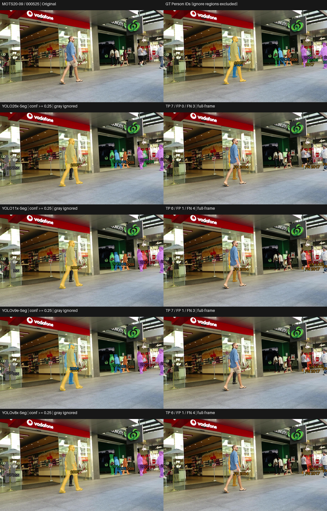
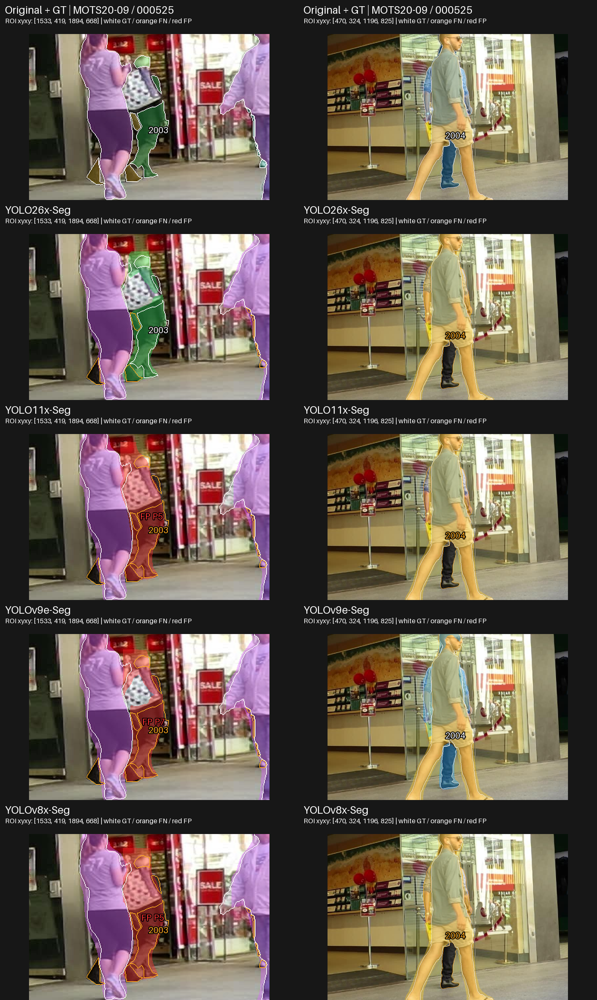
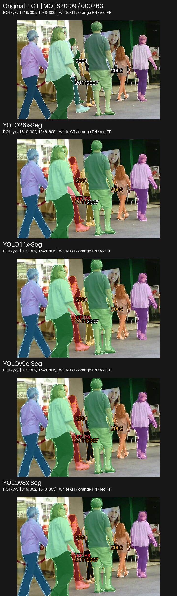
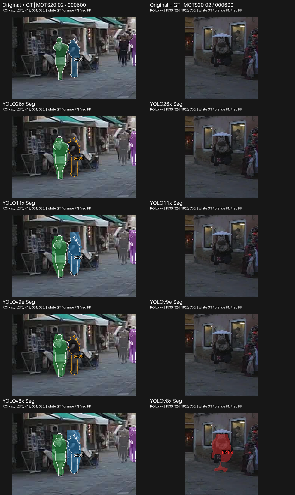
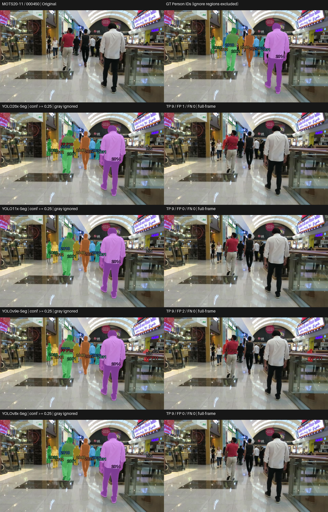
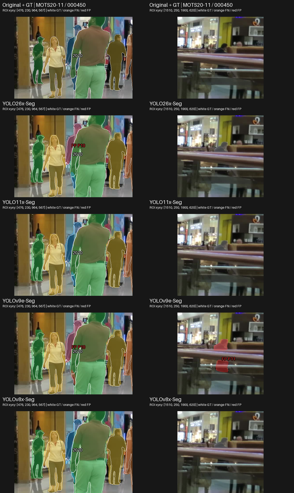

# Largest (X/E) — Visual and Qualitative Analysis

## 1. ภาพรวมผลการทดลอง

Tier นี้เสร็จครบ 4 โมเดลบน MOTS20 ด้วย pretrained / no fine-tuning; คงสถานะ PASS WITH WARNINGS
เอกสารนี้อ่านพฤติกรรมจาก prediction จริง ส่วนผลเชิงตัวเลขและ trade-off เต็มอยู่ที่ [RESULTS_SUMMARY_TH.md](RESULTS_SUMMARY_TH.md)

| Model | Mask mAP50-95 | AP75 | Recall |
|---|---|---|---|
| YOLO26x-Seg | 0.603730 | 0.664426 | 0.846285 |
| YOLO11x-Seg | 0.536674 | 0.575845 | 0.822228 |
| YOLOv9e-Seg | 0.536642 | 0.572100 | 0.826578 |
| YOLOv8x-Seg | 0.524758 | 0.560452 | 0.814271 |

## การเลือกกรณีและการอ่านภาพ

คัด 4 กรณีจาก 12 เฟรมใน frozen visualization manifest โดยอ่าน per-frame TP/FP/FN และตรวจ original/GT กับ saved masks เลือก 1 shared anchor (Case 2: MOTS20-09 / 000263) และอีก 3 diagnostic cases ตามพฤติกรรมของ tier นี้ มีทั้งข้อได้เปรียบ ข้อผิดพลาดร่วม กรณีสวนอันดับ และ near-tie/ผลคล้ายกันเพื่อลด cherry-picking ไม่ใช่การสุ่มตัวแทน dataset
ภายในแต่ละ case ต้องใช้เฟรมเดียวกันครบทุกโมเดล ส่วนระหว่าง tier ใช้ภาพร่วมเมื่อมีเหตุผลในการเทียบ error เดียวกัน ไม่บังคับใช้ชุดภาพเหมือนกันทั้งหมด แต่ละ tier มี 4 cases; ชุดใหม่รวม 10 original frames ต่างกันจากเดิม 6 และเพิ่มฉาก MOTS20-11 ข้อมูลที่ซ้ำข้าม tier ไม่ใช่ตัวอย่างอิสระเพิ่ม
[CASE_SELECTION.md](outputs/visualizations/qualitative/selection_v2/CASE_SELECTION.md) บันทึกเหตุผลและแหล่งหลักฐาน
ภาพเดิมมี contact sheet แยกโมเดล จึงสร้าง comparison จาก lossless saved RLE และ original/GT โดยไม่ inference
แถวแรกเป็น Original/GT; แถวถัดมาเรียง YOLO26, YOLO11, YOLOv9, YOLOv8;
ซ้ายเป็น prediction ขวาเป็น unmatched overlay ทั้งหมดใช้ภาพเต็มเฟรมเดียวกันและ scale เท่ากัน
สีของ matched mask ผูกกับ GT ID เดียวกัน; สีส้ม FN, สีแดง FP, สีเทา IGN (ignored prediction)
ใช้ confidence ≥0.25, mask matching IoU ≥0.50 และ ignore policy เดิม
FN หมายถึง GT ที่ไม่มีคู่ผ่านเกณฑ์ อาจมาจาก mask ไม่ผ่าน IoU ไม่ใช่ไม่มี detection เสมอ;
FP หมายถึง prediction ที่ไม่ match valid GT และไม่ถูก ignore จึงไม่จำเป็นต้องเป็นคนที่ไม่มีอยู่จริง
GT panel แสดงเฉพาะ Person; IGN ไม่ถูกนับเป็น FP ตัวเลขรายเฟรมตรวจตรงกับ CSV เดิม

### Case เหล่านี้ช่วยตัดสินใจอย่างไร

ชุดนี้ใช้ประกอบการเลือกด้านความครบถ้วนของ instance และ unmatched output โดยอ่านร่วมกับ canonical metrics ไม่ได้ให้ผู้ชนะทุกภาพหรือใช้วัด latency/VRAM Case 2 เป็นเฟรมร่วมเพื่อเทียบข้อจำกัดบน source เดียวกัน อีก 3 cases เลือกตามพฤติกรรมของ tier; หากเฟรม diagnostic ตรงกับ tier อื่น เหตุผลต้องอยู่ใน CASE_SELECTION.md และไม่นับเป็นหลักฐานอิสระเพิ่ม 4 cases ไม่แทน 2,862 เฟรม

| Case | Pain point / บทบาท | ใช้ประกอบการเลือกด้านใด |
|---|---|---|
| 1 | จำแนกโมเดล / ต่าง GT: GT 2003 ด้านขวาและ GT 2004 ด้านหลังคนใหญ่ | ใช้พิจารณา coverage ร่วมกับ extra masks: YOLO26x เก็บ 2003 โดยไม่มี FP แต่ YOLOv9e เก็บ 2004 ที่ YOLO26x พลาด แม้ทั้งคู่มี TP 7 เท่ากัน |
| 2 | ข้อจำกัดร่วม: FN และ unmatched mask กลางกลุ่มคน | ใช้ตั้งข้อจำกัดเมื่อความครบถ้วนของ Person ที่อยู่ระหว่างคนอื่นสำคัญ และตรวจการแยก instance ก่อนคัดโมเดล; ทุกโมเดลยังมีข้อผิดพลาด |
| 3 | สวนอันดับ / near-tie: GT 2029 และ extra mask ใต้ร่ม | ช่วยตรวจคู่ near-tied YOLO11x/YOLOv9e: YOLO11x match 2029 ได้ แต่ YOLOv9e ไม่ได้; YOLOv8x เก็บครบแต่มี extra mask ริมขวา |
| 4 | near-tie / extra-instance output: mask ส่วนเกินทับ GT 2010 และบริเวณราวด้านขวา | ใช้เทียบ YOLO11x/YOLOv9e ที่ mAP แทบเท่ากัน: ทั้งคู่เก็บ valid GT ครบ แต่ YOLOv9e มี FP สอง mask ขณะที่ YOLO11x ไม่มีในเฟรมนี้ |

ภาพขยายเป็น ROI เพิ่มเติมจาก original frames และ saved masks แถวแรก Original/GT ต่อด้วยโมเดลตามลำดับเดิม แต่ละคอลัมน์ใช้พิกัด/scale เดียวกันทุกโมเดล แถว Original/GT ใช้เส้นขาวแสดง valid GT; ในแถวโมเดลเส้นขาวคือ GT ที่ match เส้นส้มคือ FN; สีแดงคือ FP สีเทาคือ ignored prediction พิกัด ROI อยู่บนภาพ ภาพเต็มยังแสดงไว้เพื่อไม่ซ่อน error นอก ROI การขยายไม่เพิ่มรายละเอียดจากต้นฉบับ
ค่าราย GT ด้านล่างเป็น diagnostic ของ saved predictions ที่ confidence ≥0.25: TP ใช้ IoU ของคู่ที่ evaluator จับจริง; FN แสดง IoU สูงสุดของ candidate ที่มี ไม่ใช่ AP และไม่เปลี่ยน benchmark ตัวเลข TP/FP/FN ในคำอธิบายเป็นของเต็มเฟรม ไม่ใช่จำนวนใน ROI

## Case 1 — เก็บคนต่าง ID แม้จำนวน TP เท่ากัน

เหตุผลที่เลือก: แยก matching บนคนด้านขวาและคนด้านหลัง พร้อมกรณีที่ตัวนำไม่ได้ชนะทุก GT · MOTS20-09 / 000525

### ภาพเปรียบเทียบ

ภาพขยายจุดที่ต้องตรวจ (ใช้คู่กับภาพเต็มด้านบน):

### สิ่งที่เห็นจากภาพ

- YOLO26x match GT 2003 ซึ่งอยู่ระหว่างคนทางขวา; อีกสามโมเดลมี FN ของ GT นี้และ mask แดงอยู่บนบริเวณคนเดียวกัน
- YOLOv9e match GT 2004 ซึ่งเห็นบางส่วนอยู่ด้านหลังคนใหญ่กลางภาพ; YOLO26x/YOLO11x/YOLOv8x มี FN ตรงนี้
- YOLO26x/YOLO11x/YOLOv9e/YOLOv8x มี TP 7/6/7/6, FP 0/1/1/1 และ FN 3/4/3/4; ทุกโมเดลยังพลาด GT 2011/2017

ตรวจ matching ราย GT จาก saved masks:

| GT | YOLO26x-Seg | YOLO11x-Seg | YOLOv9e-Seg | YOLOv8x-Seg |
|---|---|---|---|---|
| 2003 | TP IoU 0.529 | FN; best IoU 0.342 | FN; best IoU 0.437 | FN; best IoU 0.366 |
| 2004 | FN; best IoU 0.071 | FN; best IoU 0.029 | TP IoU 0.610 | FN; best IoU 0.064 |

IoU ที่ปัดเป็น 0.000 ไม่ยืนยันว่าไม่มี prediction; FN หมายถึงไม่มีคู่ผ่าน evaluator ตาม policy เดิม

### วิเคราะห์

ROI ซ้ายแสดงว่า mask บนคนจริงอาจได้ FN และ FP พร้อมกันเมื่อ mask ไม่ตรง GT พอ: candidate IoU ของ GT 2003 ในสามโมเดลอยู่ต่ำกว่า 0.50 ส่วน ROI ขวาแสดง instance ที่ YOLOv9e เก็บเพิ่มได้โดย YOLO26x พลาด การเลือกจากจำนวน TP อย่างเดียวจึงซ่อนความต่างของคนที่ได้จริง ต้องดูว่า error ตำแหน่งใดสำคัญต่อการใช้งาน ไม่สรุปว่าตัวนำเก็บทุกคนดีกว่า

### เชื่อมกับผลเชิงตัวเลข

YOLO26x มี mAP/AP75/Recall รวมสูงสุด ตัวอย่าง GT 2003 สอดคล้องในทิศทางกับ coverage ที่ดีกว่า แต่ GT 2004 เป็นข้อยกเว้นในเฟรมเดียวกัน ส่วน YOLO11x/YOLOv9e มี mAP 0.536674/0.536642 ใกล้กันมาก แต่ชุด GT ที่ match ต่างกัน ภาพนี้อธิบายชนิดของ error ได้โดยไม่อธิบายคะแนนทั้ง dataset

### ใช้ประกอบการเลือกอย่างไร

**Pain point / บทบาท:** จำแนกโมเดล / ต่าง GT — GT 2003 ด้านขวาและ GT 2004 ด้านหลังคนใหญ่

**ใช้ประกอบการเลือก:** ใช้พิจารณา coverage ร่วมกับ extra masks: YOLO26x เก็บ 2003 โดยไม่มี FP แต่ YOLOv9e เก็บ 2004 ที่ YOLO26x พลาด แม้ทั้งคู่มี TP 7 เท่ากัน

**ขอบเขตหลักฐาน:** YOLO11x/YOLOv9e/YOLOv8x มี prediction บนบริเวณ GT 2003 แต่ไม่ผ่าน matching; FN ไม่ใช่ไม่มี detection และ TP เท่ากันไม่ใช่เก็บคนชุดเดียวกัน

## Case 2 — พลาดร่วมกันในกลุ่มคนซ้อนกัน

เหตุผลที่เลือก: shared anchor ของทั้งห้า tier เพื่อเทียบข้อผิดพลาดบน source frame เดียวกัน;  แสดงข้อจำกัดร่วมและ FP ของทุกโมเดล แทนเลือกแต่ภาพที่ตัวนำได้เปรียบ · MOTS20-09 / 000263

### ภาพเปรียบเทียบ

ภาพขยายจุดที่ต้องตรวจ (ใช้คู่กับภาพเต็มด้านบน):

### สิ่งที่เห็นจากภาพ

- ทุกโมเดลมี FN ของ GT 2001/2002/2011 ในกลุ่มคนกลางภาพ และ 2023 ริมขวา; GT บางส่วนอยู่หลังคนอื่นและมองเห็นเป็นพื้นที่เล็ก
- ทุกโมเดลมี FP แดงบริเวณคนกลางภาพ ถึงแม้หลายคนด้านหน้าจะมี matched mask แล้ว
- YOLO26x และ YOLO11x เก็บได้ 9 instances; YOLOv8x และ YOLOv9e เก็บได้ 8 instances แต่ทั้งหมดก็ยังมี FN หลายตำแหน่ง

ตรวจ matching ราย GT จาก saved masks:

| GT | YOLO26x-Seg | YOLO11x-Seg | YOLOv9e-Seg | YOLOv8x-Seg |
|---|---|---|---|---|
| 2001 | FN; best IoU 0.269 | FN; best IoU 0.241 | FN; best IoU 0.263 | FN; best IoU 0.249 |
| 2002 | FN; best IoU 0.010 | FN; best IoU 0.010 | FN; best IoU 0.010 | FN; best IoU 0.010 |
| 2007 | TP IoU 0.683 | TP IoU 0.638 | FN; best IoU 0.034 | FN; best IoU 0.060 |
| 2011 | FN; best IoU 0.395 | FN; best IoU 0.379 | FN; best IoU 0.412 | FN; best IoU 0.377 |

IoU 0.000 คือค่าที่ปัดสามตำแหน่ง ไม่ยืนยันว่าไม่มี prediction; candidate อาจมีพื้นที่ทับ GT ต่ำหรือมีคู่กับ GT อื่นแล้ว FN จึงต้องอ่านร่วมกับภาพและ full-frame matching

### วิเคราะห์

ส่วนที่พลาดไม่ได้มีเฉพาะคนไกล แต่รวมพื้นที่ GT เล็กในกลุ่มคนที่ซ้อนกันด้วย FP บาง mask อยู่บนคนจริงที่ไม่ match ตามเกณฑ์ จึงควรอ่านว่า segmentation/matching error ก่อนเรียกว่า hallucinated person จำนวนคนที่เก็บได้เพิ่มยังเกิดพร้อม FP ได้ ภาพนี้ไม่พิสูจน์สาเหตุของ error หรือความทนทานต่อ occlusion ของทั้ง dataset

### เชื่อมกับผลเชิงตัวเลข

แม้ YOLO26x มี mAP/AP75 รวมสูงสุด ก็ยังเกิด FN และ FP ในกรณีนี้; ภาพช่วยเห็นข้อจำกัดที่คะแนนเฉลี่ยไม่แสดง การสรุปจำนวน FN/FP ทั้ง dataset ต้องอ่าน canonical CSV ไม่คูณจากกรณีนี้

### ใช้ประกอบการเลือกอย่างไร

**Pain point / บทบาท:** ข้อจำกัดร่วม — FN และ unmatched mask กลางกลุ่มคน

**ใช้ประกอบการเลือก:** ใช้ตั้งข้อจำกัดเมื่อความครบถ้วนของ Person ที่อยู่ระหว่างคนอื่นสำคัญ และตรวจการแยก instance ก่อนคัดโมเดล; ทุกโมเดลยังมีข้อผิดพลาด

**ขอบเขตหลักฐาน:** ไม่ใช้เป็นหลักฐานว่ารุ่นใด robust ต่อ occlusion ทั้ง dataset

## Case 3 — กรณีสวนอันดับและ trade-off ของ detection

เหตุผลที่เลือก: รวมตัวอย่างที่ accuracy leader ไม่ได้เก็บ Person มากที่สุด · MOTS20-02 / 000600

### ภาพเปรียบเทียบ

ภาพขยายจุดที่ต้องตรวจ (ใช้คู่กับภาพเต็มด้านบน):

### สิ่งที่เห็นจากภาพ

- YOLO11x และ YOLOv8x match GT ทั้ง 10 instances; YOLO26x และ YOLOv9e มี FN 2029 ในกลุ่มคนไกลด้านซ้าย
- YOLOv8x มี FP เพิ่มบริเวณวัตถุใต้ร่มริมขวา แต่ YOLO11x ไม่มี FP; กลุ่ม Person ด้านหน้าขวายังคงถูกแยกเป็นหลาย instance ในทุกโมเดล

ตรวจ matching ราย GT จาก saved masks:

| GT | YOLO26x-Seg | YOLO11x-Seg | YOLOv9e-Seg | YOLOv8x-Seg |
|---|---|---|---|---|
| 2029 | FN; best IoU 0.000 | TP IoU 0.600 | FN; best IoU 0.000 | TP IoU 0.561 |

IoU 0.000 คือค่าที่ปัดสามตำแหน่ง ไม่ยืนยันว่าไม่มี prediction; candidate อาจมีพื้นที่ทับ GT ต่ำหรือมีคู่กับ GT อื่นแล้ว FN จึงต้องอ่านร่วมกับภาพและ full-frame matching

### วิเคราะห์

นี่เป็นกรณีสวนอันดับรวม: YOLO11x เก็บครบและไม่มี FP ส่วน YOLO26x พลาด Person ไกล แม้มี mAP รวมสูงกว่า ส่วน YOLOv8x เก็บครบแลกกับ FP เพิ่ม จึงต้องแยกการเก็บคนกับความแม่นของแต่ละ mask ไม่มีการเปลี่ยน confidence ให้โมเดลใดเป็นพิเศษ และบริเวณ FP ริมขวายังคงแสดงเต็มภาพ ไม่ crop เพื่อซ่อน error

### เชื่อมกับผลเชิงตัวเลข

YOLO26x มี Recall รวมสูงสุด 0.846285 แต่ไม่ได้มี TP สูงสุดทุกเฟรม; AP75 ใช้ mask IoU 0.75 และ confidence ranking จึงไม่แทนด้วย TP ที่ IoU 0.50 ของเฟรมนี้ ความต่างของ matched-mask IoU ใช้เฉพาะคู่ที่ผ่าน matching และไม่รวมคนที่พลาด

### ใช้ประกอบการเลือกอย่างไร

**Pain point / บทบาท:** สวนอันดับ / near-tie — GT 2029 และ extra mask ใต้ร่ม

**ใช้ประกอบการเลือก:** ช่วยตรวจคู่ near-tied YOLO11x/YOLOv9e: YOLO11x match 2029 ได้ แต่ YOLOv9e ไม่ได้; YOLOv8x เก็บครบแต่มี extra mask ริมขวา

**ขอบเขตหลักฐาน:** หากเน้นคนไกล ต้องพิจารณา error นี้ร่วมกับ Recall รวม ไม่คัด YOLO26x ทิ้งจากเฟรมเดียว

## Case 4 — เก็บ GT ครบ แต่ mask ส่วนเกินต่างกัน

เหตุผลที่เลือก: เปลี่ยนภาพควบคุมที่ไม่มี FP เป็น near-tie check ที่เห็น error เพิ่มจริง · MOTS20-11 / 000450

### ภาพเปรียบเทียบ

ภาพขยายจุดที่ต้องตรวจ (ใช้คู่กับภาพเต็มด้านบน):

### สิ่งที่เห็นจากภาพ

- ทุกโมเดล match valid GT ครบ 9 instances และไม่มี FN; Person หลักในทางเดินจึงมี coverage เหมือนกันในเฟรมนี้
- YOLO26x มี FP P10 และ YOLOv9e มี FP P10 บนบริเวณ GT 2010 ซึ่งมี matched prediction อยู่แล้ว; IoU ของ FP กับ GT นี้ประมาณ 0.606/0.648 แต่ไม่เป็น TP เพิ่มเพราะ one-to-one matching
- YOLOv9e มี FP P11 เพิ่มบริเวณราวด้านขวา ซึ่งไม่ทับ valid GT; YOLO11x/YOLOv8x ไม่มี FP ส่วน YOLO26x/YOLOv9e มี 1/2 ตามลำดับ

ตรวจ matching ราย GT จาก saved masks:

| GT | YOLO26x-Seg | YOLO11x-Seg | YOLOv9e-Seg | YOLOv8x-Seg |
|---|---|---|---|---|
| 2010 | TP IoU 0.670 | TP IoU 0.638 | TP IoU 0.576 | TP IoU 0.617 |

IoU ที่ปัดเป็น 0.000 ไม่ยืนยันว่าไม่มี prediction; FN หมายถึงไม่มีคู่ผ่าน evaluator ตาม policy เดิม

### วิเคราะห์

การดูเฉพาะ GT ที่เก็บได้ทำให้ผลดูคล้ายกัน แต่ extra masks ทำให้จำนวน output และภาระคัดกรองต่างกัน FP P10 ไม่ได้เกิดจากหา person ที่ไม่มีจริง: มี mask อีกอันบน GT ที่ได้คู่แล้ว ส่วน P11 ต้องอ้างอิง valid GT/ignore policy จึงไม่เรียกว่า hallucination จากภาพเดียว สิ่งที่ใช้เลือกได้คือ trade-off ระหว่าง coverage กับ output ส่วนเกินในตัวอย่างนี้

### เชื่อมกับผลเชิงตัวเลข

YOLO11x/YOLOv9e มี mAP ใกล้กันมาก แต่เฟรมนี้แยก extra-output behavior ได้แม้ TP/FN เท่ากัน ขณะเดียวกัน YOLO26x ซึ่งนำ mAP รวมก็มี FP เพิ่ม จึงไม่ควรใช้ความต่างหลักทศนิยมท้าย ๆ หรือตัวอย่างเดียวตัดสินผู้ชนะ; ผลด้านความเร็วและ VRAM ของ YOLOv9e ต้องอ่านจาก benchmark

### ใช้ประกอบการเลือกอย่างไร

**Pain point / บทบาท:** near-tie / extra-instance output — mask ส่วนเกินทับ GT 2010 และบริเวณราวด้านขวา

**ใช้ประกอบการเลือก:** ใช้เทียบ YOLO11x/YOLOv9e ที่ mAP แทบเท่ากัน: ทั้งคู่เก็บ valid GT ครบ แต่ YOLOv9e มี FP สอง mask ขณะที่ YOLO11x ไม่มีในเฟรมนี้

**ขอบเขตหลักฐาน:** FP บน GT ที่มีคู่แล้วไม่ใช่คนปลอม; mask บริเวณราวไม่ทับ valid GT แต่ยังไม่พิสูจน์ว่าไม่มีคนจริงหรือเป็นความผิดพลาดที่เกิดบ่อย

## Failure Analysis

| Failure pattern | Models observed | Visual case | Interpretation |
|---|---|---|---|
| Unmatched mask บน Person ที่ mask ไม่ผ่าน matching | YOLO11x/YOLOv9e/YOLOv8x (GT 2003) | Case 1 | มี prediction อยู่จริงแต่ IoU ต่ำกว่า 0.50; ไม่ใช่ absence ทุกครั้ง |
| Unmatched GT ในกลุ่มคน / หลังคนใหญ่ | ทุกโมเดล; GT 2004 เฉพาะ YOLO26x/YOLO11x/YOLOv8x | Case 1/2 | ตัวนำไม่ชนะทุก GT; Case 2 เป็นข้อจำกัดร่วม |
| Extra mask บน Person ที่มีคู่แล้ว | YOLO26x/YOLOv9e (GT 2010) | Case 4 | one-to-one matching ทำให้ mask เพิ่มไม่เป็น TP อีกคู่ |
| Extra mask ที่ไม่ทับ valid GT | YOLOv9e บริเวณราว; YOLOv8x ใต้ร่ม | Case 4/3 | FP ตาม policy; ไม่ยืนยันว่าไม่มีคนจริง |

เป็นประเภท error ที่พบในกรณีที่เลือก ไม่ใช่อัตราหรือความถี่ทั้ง dataset ไม่ระบุ merging/fragmentation/boundary leakage หากไม่มีหลักฐานพอ

## Near-tie visual check

YOLO11x/YOLOv9e มี mAP 0.536674/0.536642 ใกล้กันมาก แต่ Case 1 YOLOv9e เก็บ GT 2004 เพิ่ม ส่วน Case 3 YOLO11x เก็บ GT 2029 ที่ YOLOv9e พลาด Case 4 ทั้งคู่ match ครบ 9 GT แต่ YOLOv9e มี FP สอง mask และ YOLO11x ไม่มี จึงเป็นคะแนนรวม near-tied ที่ซ่อน error ต่างชนิด/ตำแหน่ง ไม่ใช่ prediction เหมือนกันหรือหลักฐานนัยสำคัญ การเลือกเมื่อ latency/VRAM สำคัญต้องอ่าน benchmark ของ YOLOv9e ควบคู่กับข้อจำกัดจากภาพ

## สิ่งที่เรียนรู้จากภาพจริง

### Observation 1

Case 1 YOLO26x/YOLOv9e มี TP 7 เท่ากัน แต่ YOLO26x เก็บ GT 2003 และ YOLOv9e เก็บ GT 2004 ที่อีกโมเดลพลาด

**Interpretation:** counts ที่เท่ากันอาจซ่อน coverage คนละชุด ควรดู GT ที่เกี่ยวกับ priority จริง

### Observation 2

Case 2 ทุกโมเดลพลาด GT ในกลุ่มคนกลางภาพ และมี unmatched prediction บนคนจริง

**Interpretation:** การแบ่ง instance และการผ่าน mask IoU เป็นคนละเรื่องกับแค่เห็นว่ามีคน; FP/FN จึงควรอ่านคู่กับ GT และ ignore policy

### Observation 3

Case 3 มีโมเดลอื่นเก็บ valid Person มากกว่า accuracy leader

**Interpretation:** อันดับรวมไม่ใช่คำรับรองทุกเฟรม; คะแนนหรือ counts ที่ใกล้กันอาจเกิดจาก error ต่างตำแหน่ง

### Observation 4

Case 4 ทุกโมเดล match GT ครบ 9 คน แต่ YOLO26x/YOLOv9e มี mask ส่วนเกิน และ YOLO11x/YOLOv8x ไม่มี FP

**Interpretation:** coverage เท่ากันไม่รับรองภาระ extra-output เท่ากัน โดยเฉพาะคู่ mAP ที่แทบเท่ากัน

## เมื่อดูทั้งตัวเลขและภาพร่วมกัน

YOLO26x นำ mAP/AP75/Recall รวม ส่วนภาพช่วยตรวจว่าความต่างอยู่ที่ GT ใดและมี output เพิ่มแบบไหน Case 1 แสดง instance ที่เก็บเพิ่ม แต่ Case 2 ยังมีข้อผิดพลาดร่วม และ Case 3 เป็นกรณีสวนอันดับ coverage Case 4 แยก extra masks แม้เก็บ valid GT ครบเหมือนกัน จึงไม่ใช้ภาพใดภาพหนึ่งอธิบายคะแนนทั้ง dataset AP75 รวม confidence ranking และ stricter IoU ซึ่งภาพที่ confidence 0.25/matching 0.50 แสดงไม่ครบ; TP-only quality อาจใช้ GT คนละชุด

Latency และ VRAM เป็น system-level measurements อ่านจาก benchmark แยกจากภาพ segmentation ไม่สามารถอนุมานสาเหตุหรือวัดสองค่านี้จาก mask

## ถ้าพิจารณาทั้งผลเชิงตัวเลขและภาพ

| Priority | Candidate | Evidence |
|---|---|---|
| Accuracy | YOLO26x-Seg | mAP/AP75/Recall รวมสูงสุด; Case 1 แสดง GT ที่เก็บเพิ่ม; Case 2/3/4 ช่วยตรวจข้อจำกัดและ error trade-off |
| Speed | YOLOv9e-Seg (inference); YOLOv9e-Seg (pipeline) | Clean timing benchmark; ภาพไม่วัดเวลา |
| Low VRAM | YOLOv9e-Seg | Peak allocated VRAM benchmark; ภาพไม่วัด memory |
| Balanced | YOLOv9e-Seg หากเน้น resource; YOLO26x-Seg หากยอมรับ latency เพิ่มเพื่อ accuracy | YOLOv9e ใกล้ YOLO11x ด้าน mAP และเร็ว/ใช้ VRAM ต่ำกว่า; Case 3 ยังพลาดคนที่ YOLO11x เก็บได้ |

เป็น candidate สำหรับ cross-tier และ CCTV robustness evaluation ภายหลัง ไม่มี weighted score หรือข้อยืนยัน final CCTV superiority

## ข้อจำกัด

- เฟรมที่เลือกเป็นตัวอย่างเชิงคุณภาพจาก 12 เฟรมเดิม ไม่แทน dataset-level metrics และไม่ใช่ representative sample
- มีทั้งข้อได้เปรียบ ข้อผิดพลาด กรณีสวนอันดับ และผลคล้ายกันเพื่อลด cherry-picking; ยังอาจพลาด error ชนิดอื่นนอก selection pool
- MOTS20 ไม่ใช่ผลทดสอบ CCTV robustness ขั้นสุดท้าย; ไม่อนุมาน blur/low-light/มุมกล้องหรือระดับ occlusion
- Qualitative observations และ numerical near ties ไม่ใช่ statistical significance
- ภาพย่อ/overlay อาจบังรายละเอียดขอบ; ตรวจ saved RLE หากต้องการตรวจพิกเซล ไม่อธิบายสาเหตุจาก architecture

## รายละเอียดเต็ม

[Quantitative summary](RESULTS_SUMMARY_TH.md) · [REPORT.md](REPORT.md) · [TIER_RESULTS.csv](metrics/TIER_RESULTS.csv) ·
[Case evidence](outputs/visualizations/qualitative/selection_v2/CASE_EVIDENCE.json) ·
[Master Study](https://github.com/folklazy/YOLO_Instance_Segmentation_MOTS20_Scaling_Study)
